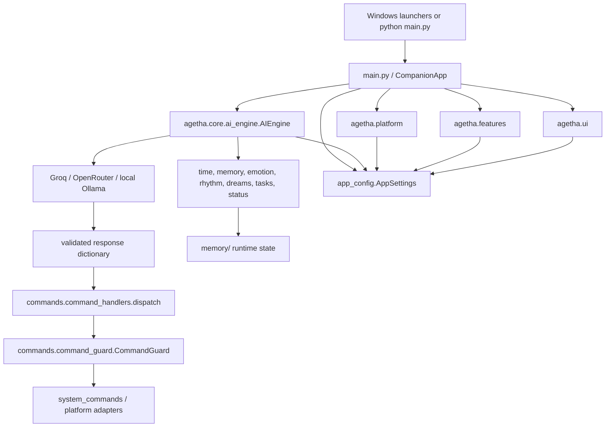

# Architecture

This document describes the current repository structure and the boundaries that
should remain intact. It is a navigation aid, not a replacement for tests or the
source of truth identified in [the documentation index](README.md).

## System at a glance

The root [main.py](../main.py) is the composition layer. It owns the Tk root,
constructs controllers, connects callbacks, starts background initialization,
and coordinates application lifecycle. Reusable logic belongs in the relevant
`agetha/` package rather than being added to `main.py`.

## Layer responsibilities

| Layer | Directory or file | Responsibility |
|---|---|---|
| Composition | `main.py` | Tk application ownership, visual state machine, worker orchestration, AI-turn lifecycle, centralized shutdown |
| Configuration | `agetha/app_config.py` | Built-in defaults, tolerant parsing, typed/clamped settings, `.env` secret overrides, atomic config patches |
| Core | `agetha/core/` | AI providers and prompt construction, date/time context, memory, emotions, relationship history, rhythm, dreams, stats, audit log |
| Commands | `agetha/commands/` | Response dispatch, confirmation and risk policy, filesystem/process/system operations |
| Features | `agetha/features/` | Optional TTS, web retrieval, tasks, status observations, and tray integration |
| Platform | `agetha/platform/` | Screen capture/OCR, voice input, window control, Windows integrations, notifications, autostart |
| UI | `agetha/ui/` | Dashboard, scaling, Win95 chrome, popup/effect controllers, mood glow and motion |
| Runtime data | `memory/`, `.env`, `conversation.txt` | Private/generated state; never a source-code dependency to copy into docs or tests |
| Validation | `tests/`, `Medic_Checker.ps1`, `medic_helper.py` | Automated behavior tests and end-user environment diagnostics |

## Application ownership

`CompanionApp` is the lifetime owner for the desktop process. It owns or refers
to:

- the Tk root, primary widgets, GIF players, subtitle renderer, and popups;
- `AIEngine`, `ScreenReader`, voice input, bleep/TTS coordination, and tray state;
- `MoodGlowController`, `MoodMotionController`, and `CRTCloseController`;
- all application-level `after()` job IDs, stop events, worker references, and
  geometry ownership flags;
- the current visual state (`sleeping`, `thinking`, `idle`, or `talking`) and
  display mood.

The constructor builds a responsive shell first. `_init_background()` performs
heavy or failure-prone setup away from the Tk thread and schedules completed UI
work with `root.after(0, ...)`. `run()` starts the optional tray integration,
enters `mainloop()`, and calls the same idempotent shutdown routine in `finally`.

### Threading contract

Tkinter is single-threaded. The repository follows these ownership rules:

1. Event handlers and `root.after()` callbacks may update widgets.
2. AI, OCR, GIF decoding, voice recognition, TTS generation, and optional
   external requests may run in workers.
3. Workers communicate results back with `root.after(0, callback)`; they must
   not call widget methods directly.
4. Repeating callbacks and geometry effects retain their job IDs so shutdown or
   state changes can cancel them.
5. Stop events and closing flags are checked before workers publish late
   results.

Do not hold a core-state lock while waiting synchronously for Tk work. The
window picker is a deliberate bridge: a worker requests a main-thread dialog
and waits for the selected value, while the dialog itself remains on the Tk
thread.

## Configuration architecture

[app_config.py](../agetha/app_config.py) is the only canonical configuration
model. `DEFAULT_CONFIG` contains the distributable defaults and comments;
`AppSettings` exposes typed properties with safe fallbacks and clamps. The
loader:

1. starts from built-in defaults;
2. parses `config.txt` as user overrides;
3. rejects secret-key placement in `config.txt`;
4. loads allowed secrets from `.env`;
5. returns a cached `AppSettings` object through `get_settings()`.

`patch_config_keys()` is the supported programmatic update route and writes
atomically. The dashboard uses this settings system instead of maintaining a
second configuration model. Some settings are live-readable; settings marked
with `*` in the dashboard require restart. Consult typed properties rather than
parsing strings independently in a feature module.

## AI engine and prompt composition

[ai_engine.py](../agetha/core/ai_engine.py) supports three provider modes behind
one `AIEngine` interface:

- Groq, with configured key rotation and token-limit handling;
- OpenRouter, through its OpenAI-compatible HTTP endpoint;
- local Ollama, through the local API and configured model.

Both `query()` and `query_streaming()` build the same logical request and pass
the returned text through `_parse()`. Provider choice must not fork command
safety or prompt behavior.

The prompt is composed from compact, bounded sections when enabled:

- system identity and `memory/soul.md`;
- local weekday/date/time/timezone from `core.time_context`;
- screen/window context labeled as untrusted external text;
- dropped-document content and notepad context;
- episodic and long-term memory search results plus session recap;
- companion stats, emotion state/history, circadian rhythm, dream recall, tasks,
  and status observations;
- web results only for explicit gated web operations;
- current user message, few-shot examples, and bounded conversation history.

The parser extracts or repairs the expected JSON object, normalizes mood and
segments, validates commands against `VALID_COMMANDS`, copies command-specific
fields into the result, applies feature gates, and records permitted memory.
Parsed model output is still untrusted: execution policy belongs to the command
layer.

## Command execution and safety

The command path has three synchronized registries:

1. `AIEngine.VALID_COMMANDS` defines what parsed model output may name.
2. `command_handlers.HANDLERS` maps names to implementations via `@register`.
3. `CommandGuard.TIER_MAP` assigns confirmation policy; an unknown name is
   treated as dangerous rather than safe.

`command_handlers.dispatch()` builds a `DispatchCtx`, applies ambient/deep-OCR
restrictions and feature gates, performs optional dry-run handling, asks the
guard for confirmation, updates stats/emotion history, then invokes the handler.
Handlers use `system_commands` or focused platform modules for operating-system
effects. They report success/failure through `CompanionApp` UI helpers and hand
speech/state control back to the application.

Never call a handler directly to avoid confirmation. A new command is incomplete
until all three registries, prompt/schema fields, configuration gates, and tests
agree. See [Adding an AI command](development.md#adding-an-ai-command).

## Screen monitoring and OCR

The screen subsystem deliberately separates capture policy from OCR backends:

- [screen_reader.py](../agetha/platform/screen_reader.py) coordinates active
  window discovery, platform capture fallbacks, OCR, exclusion/redaction,
  pattern scanning, and stale-result protection.
- [screen_monitoring.py](../agetha/platform/screen_monitoring.py) contains pure
  preprocessing, thumbnail change detection, per-window state, event
  confirmation/cooldown, exclusions, and sensitive-text redaction.
- [ocr_backends/base.py](../agetha/platform/ocr_backends/base.py) defines
  structured words, lines, results, and prompt formatting.
- `TesseractOCRBackend` is the automatic local backend.
- `UnlimitedOCRBackend` is optional, explicit-only deep OCR and may call a
  configured HTTP service. It is never the ambient polling backend.

Normal polling captures the focused window where supported, skips configured
applications/titles and Agetha itself, avoids rescanning unchanged frames, then
places bounded redacted text and pattern metadata into an ambient AI turn.
`analyze_screen_deep` is blocked for ambient turns and must pass the command
guard before an explicit capture/request.

Platform fallbacks are best-effort. Windows uses native foreground-window and
monitor information plus available capture libraries. Linux considers display
availability, X11/Wayland, and installed screenshot tools. Unsupported capture
or OCR returns a safe empty/error result rather than crashing the UI.

## UI architecture

The primary Win95 companion surface remains in `CompanionApp`; focused reusable
effects live under `agetha/ui/`:

- `display_scale` selects a bounded scale from Tk DPI, display size, and an
  optional user override. Dimensions and fonts are derived from that scale.
- `dashboard` creates a separate settings/monitoring window and is kept outside
  the startup-critical path.
- `w95_window` owns borderless title-bar behavior and Windows caption removal.
- `MoodGlowController` owns the optional GIF border color and its single pulse
  job.
- `MoodMotionController` serializes temporary geometry motion, observes drag,
  minimize, close, attention-snap, and cooldown guards, and restores a stable
  position.
- `CRTCloseController` owns the cancellable close sequence and calls the
  application shutdown callback exactly once.
- `glitch_overlay` and `virus_trivia` are optional, separately gated surfaces.

`_apply_state()` selects GIF behavior. It forwards the display mood to glow, but
response motion is requested once from the completed-response path rather than
on every state change. Geometry ownership is centralized so attention snap,
dragging, motion, minimize, and shutdown do not fight each other.

## Optional feature boundaries

Optional modules must remain silent no-ops when disabled or when their optional
dependency is absent:

- `TTSPlayer` and `VoiceOutputCoordinator` add synthesized speech without
  removing the existing bleep/subtitle path.
- `web_rag` performs bounded search/fetch with URL validation and formats text as
  untrusted prompt context.
- `tray_scaffold` imports `pystray` lazily and only changes close behavior when
  both tray and background-close settings permit it.
- `status_providers` polls bounded local observations and queues summaries for a
  future prompt.
- `tasks` persists a small local task list.

No optional package is allowed to become a mandatory import on the basic launch
path.

## Persisted state

Runtime state is private and generated. Modules own distinct files to reduce
cross-feature coupling:

| Owner | Runtime file | Shape and purpose |
|---|---|---|
| `AIEngine` / legacy compatibility | `conversation.txt`, `memory/memory.txt` | Bounded/legacy conversation and summary text |
| `memory_system` | `memory/soul.md` | Character identity supplied to the system prompt |
| `memory_system` | `memory/episodic_memory.json` | Recent structured episodic memories |
| `memory_search` | `memory/longterm_memory.jsonl` | Append-only searchable summaries |
| `companion_stats` | `memory/companion_stats.json` | Interaction counters and relationship/gameplay stats |
| `emotion_engine` | `memory/emotional_state.json` | Current decaying emotional dimensions |
| `emotional_history` | `memory/emotional_history.jsonl` | Sanitized weighted relationship events |
| `dreams` | `memory/dreams.jsonl` | Generated dream records and wake recall |
| `tasks` | `memory/tasks.json` | User task records |
| `audit_log` | `memory/audit_log.jsonl` | Bounded diagnostic/action audit events |
| `voice_input` | `memory/settings.json` | Selected microphone settings |
| `win_integration` | `memory/theme_backup.json` | Data required to roll back theme changes |
| `dashboard` | `memory/notepad.txt` | User notepad content injected only when applicable |

Rewrites use `write_atomic()` or a module-local temporary-file/`os.replace()`
equivalent where applicable. JSONL stores are append-oriented and protected by
module locks. Corrupt or missing files should fall back to safe empty/default
state. Do not put API keys, full OCR captures, or arbitrary command output into
these stores.

## Startup and shutdown boundaries

Startup is intentionally staged: validate/create config, establish Windows
notification identity where supported, construct the visible shell, then load
heavy resources in the background. There is no separate always-on-top startup
window.

All close paths converge on `CompanionApp._request_close()` and then
`_graceful_shutdown()` (directly or through `CRTCloseController`). The shutdown
guard makes cleanup idempotent. It cancels controller jobs and application
timers, stops voice/TTS/bleeps/screen activity, closes tray and child surfaces,
signals workers, stops pygame when active, and finally destroys the root.

See [Runtime flows](runtime_flows.md) for step-by-step sequences and
[Development](development.md) for change checklists.
