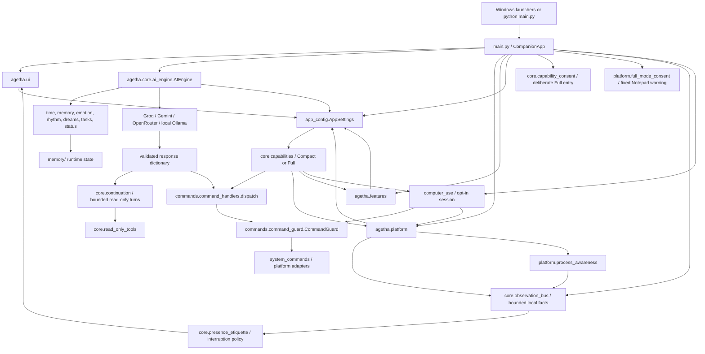

# Architecture

This document describes the current repository structure and the boundaries that
should remain intact. It is a navigation aid, not a replacement for tests or the
source of truth identified in [the documentation index](README.md).

## System at a glance

The root [main.py](../main.py) is the composition layer. It owns the Tk root,
constructs controllers, connects callbacks, starts background initialization,
and coordinates application lifecycle. Reusable logic belongs in the relevant
`agetha/` package rather than being added to `main.py`.

## Layer responsibilities

| Layer | Directory or file | Responsibility |
|---|---|---|
| Composition | `main.py` | Tk application ownership, visual state machine, worker orchestration, AI-turn lifecycle, centralized shutdown |
| Configuration | `agetha/app_config.py` | Built-in defaults, tolerant parsing, typed/clamped settings, `.env` secret overrides, atomic config patches |
| Core | `agetha/core/` | AI providers and prompt construction, central Compact/Full capability policy and consent state, bounded continuation, read-only tool outcomes, date/time context, memory, emotions, relationship history, rhythm, dreams, stats, audit log, typed observations, and local presence decisions |
| Commands | `agetha/commands/` | Response dispatch, confirmation and risk policy, filesystem/process/system operations |
| Features | `agetha/features/` | Optional TTS, web retrieval, tasks, status observations, tray integration, and opt-in Terminal Sentinel policy |
| Platform | `agetha/platform/` | Screen capture/OCR, process/application awareness, exact Unicode entry, fixed Full-consent Notepad bootstrap, source/frozen self identity, voice input, window control, Windows integrations, notifications, autostart |
| Computer Use | `agetha/computer_use/` | Opt-in immutable observations/actions, one-action planner routing, deterministic policy/execution/verification, target locking, and bounded session ownership |
| UI | `agetha/ui/` | Dashboard and Senses capability view, scaling, Win95 chrome, typing/Sentinel/Computer Use status surfaces, popup/effect controllers, mood glow and motion |
| Runtime data | `memory/`, `.env`, `conversation.txt` | Private/generated state; never a source-code dependency to copy into docs or tests |
| Validation | `tests/`, `Medic_Checker.ps1`, `medic_helper.py` | Automated behavior tests and end-user environment diagnostics |

## Application ownership

`CompanionApp` is the lifetime owner for the desktop process. It owns or refers
to:

- the Tk root, primary widgets, GIF players, subtitle renderer, and popups;
- `AIEngine`, `ScreenReader`, voice input, bleep/TTS coordination, and tray state;
- the bounded `ObservationBus`, optional `PresenceEtiquette`, Terminal Sentinel,
  `ProcessAwareness`, `ContinuationEngine`, the optional `ComputerUseManager`,
  active Unicode/Computer Use cancellation, the Senses panel, and owned status
  or Sentinel popups;
- `CapabilityController`, the pure consent state machine, consent UI/effect
  ownership, and the mode-transition generation used to reject stale Full work;
- `MoodGlowController`, `MoodMotionController`, and `CRTCloseController`;
- all application-level `after()` job IDs, stop events, worker references, and
  geometry ownership flags;
- the current visual state (`sleeping`, `thinking`, `idle`, or `talking`) and
  display mood.

The constructor builds a responsive shell first. `_init_background()` performs
heavy or failure-prone setup away from the Tk thread and schedules completed UI
work with `root.after(0, ...)`. `run()` starts the optional tray integration,
enters `mainloop()`, and calls the same idempotent shutdown routine in `finally`.

### Threading contract

Tkinter is single-threaded. The repository follows these ownership rules:

1. Event handlers and `root.after()` callbacks may update widgets.
2. AI, OCR, GIF decoding, voice recognition, TTS generation, and optional
   external requests may run in workers.
3. Workers communicate results back with `root.after(0, callback)`; they must
   not call widget methods directly.
4. Repeating callbacks and geometry effects retain their job IDs so shutdown or
   state changes can cancel them.
5. Stop events and closing flags are checked before workers publish late
   results.

Do not hold a core-state lock while waiting synchronously for Tk work. The
window picker is a deliberate bridge: a worker requests a main-thread dialog
and waits for the selected value, while the dialog itself remains on the Tk
thread.

## Configuration architecture

[app_config.py](../agetha/app_config.py) remains the public compatibility facade
and transaction coordinator. `DEFAULT_CONFIG` contains the distributable
defaults and comments; `AppSettings` exposes typed properties with safe
fallbacks and clamps. `agetha.config.io` owns durable atomic replacement, and
`agetha.config.transactions` owns pure structural document edits. The loader:

1. starts from built-in defaults;
2. parses `config.txt` as user overrides;
3. rejects secret-key placement in `config.txt`;
4. loads allowed secrets from `.env`;
5. returns a cached `AppSettings` object through `get_settings()`.

Structural config updates preserve comments, ordering, blank lines, unknown
keys, and duplicate-key semantics while writing atomically. The dashboard uses
this settings system instead of maintaining a second configuration model. Some
settings are live-readable; settings marked with `*` in the dashboard require
restart. Consult typed properties rather than parsing strings independently in
a feature module.

Normal startup also compares the existing document with the conservative
`SettingSpec` registry. Missing canonical non-secret settings are appended in
registry order through the same structural atomic writer. Existing lines and
values are untouched; secrets, Compact markers, and Fast Mode snapshots remain
outside this migration.

`agetha.config.schema.SETTING_SPECS` contains the canonical machine facts for a
small stable subset of typed settings. Runtime defaults, strict ranges, and enum
choices for those keys derive from the registry. The checked-in
[settings reference](generated/settings_reference.md) is downstream output.
Compact, Fast Mode, secrets, and other settings with special behavior remain in
procedural code.

`COMPACT_MODE=yes` is the default for a missing/fresh key. It is typed and
persisted through the same structural atomic patch, but is deliberately absent
from Fast Mode's managed overrides. A stored `no` means the user previously
completed the consent flow and is respected on restart; it is not a claim that
local configuration is tamper-proof.

`core.fast_mode_profile` coordinates the reversible Fast Mode transaction. The
approved 13-key map is canonical in `app_config`; activation writes a restricted,
schema-versioned snapshot before forcing values in `config.txt`, and restoration
writes and validates only the managed keys before removing that snapshot. A
manual third-value edit is retained as the post-Fast preference, while unrelated
settings are never rolled back. Startup reconciliation occurs before settings
are cached, repairs managed drift idempotently, and applies a validated cached
runtime overlay after `.env` loading without changing `.env` itself. Invalid
active metadata fails closed instead of inventing new originals. A completed
restoration is marked inactive before snapshot deletion so cleanup failure can
only retry cleanup, never replay restoration.

Cross-process transactions use a persistent operating-system lock, bounded
retry, no-follow/reparse-aware opening, and a second validation of every owned
path after the lock is held. Config and snapshot replacements use exclusive
same-directory temporary files plus flush/fsync/replace. See
[Fast Mode security and recovery](fast_mode_security.md) for the threat model,
audit events, ambiguous-write semantics, and operator commands.

## Compact/Full capability architecture

[`capabilities.py`](../agetha/core/capabilities.py) is the provider-neutral outer
policy boundary. `CapabilityPolicy` combines `COMPACT_MODE` with individual
feature switches. `CapabilityController` owns the active policy, transition
flag, and generation-bound authorizations. Compact allows chat, basic memory,
emotion/personality, configured WebRAG, and configured read-only continuation;
it denies Terminal Sentinel, Process Awareness, Computer Use and its planners,
OS typing/control, background sensing, and advanced OS integration. Full only
makes those capabilities eligible—their existing feature gates and safety
checks continue to decide the effective result.

Command dispatch classifies model commands at this central boundary before OS
preflight or Command Guard. This does not replace Command Guard: a Full-eligible
command must still pass its normal feature flag, authority, confirmation,
protected-target, target-lock, cancellation, and shutdown checks. A provider
cannot change the policy. Effect authorizations include the mode generation and
are rechecked at the immediate effect boundary.

[`capability_consent.py`](../agetha/core/capability_consent.py) contains the pure
`COMPACT -> FIRST_CONFIRMATION -> CONSENT_DEMO -> FINAL_CONFIRMATION ->
FULL/COMPACT` state machine. The external presentation is isolated in
[`full_mode_consent.py`](../agetha/platform/full_mode_consent.py): it may launch
only fixed Notepad and type only its compiled warning after strict process/HWND
revalidation. It accepts no arbitrary text and has no provider, planner,
Computer Use, web, OCR, clipboard, shell, or Python-helper route. Full remains
inactive until final confirmation.

The optional warning shake and all consent dialogs are Tk-owner-thread work,
with bounded/cancellable `after()` jobs and a non-motion treatment under reduced
motion. Failure to launch or validate Notepad types nothing and uses an in-app
fallback before the same final decision.

Returning from Full starts by publishing a transitioning Compact policy and
invalidating the Full generation. This blocks new effects before Computer Use,
planner/recovery, Sentinel, Process Awareness, advanced observation, workers,
timers, and UI are stopped. Stale callbacks are discarded; Compact persistence
and presentation complete only behind the already active deny boundary. See
[Compact and Full profiles](compact_full_mode.md).

## AI engine and prompt composition

[ai_engine.py](../agetha/core/ai_engine.py) owns prompt, parser, repair,
history, and Agetha request semantics. A small `ProviderRouter` delegates
request transport and provider request shape to four adapters:

- Groq, with configured key rotation;
- Google Gemini, through its REST and SSE generation endpoints;
- OpenRouter, through its OpenAI-compatible HTTP endpoint;
- local Ollama, through the local API and configured model.

Groq model normalization, GPT-OSS reasoning options, JSON Object Mode, and SDK
construction live in `agetha.providers.groq`. Gemini, OpenRouter, and Ollama own
their HTTP request, stream, usage, and error conversion details. AIEngine retains key
and provider fallback because those loops also own authorization, UI exhaustion,
repair, and final publication semantics.

Both `query()` and `query_streaming()` build the same logical request and pass
the returned text through `_parse()`. Provider choice must not fork command
safety or prompt behavior. Fast Mode selects a bounded internal request profile
for ambient, command, user, tool-result, or explicit deep-analysis work. These
profiles constrain history and optional context but do not change provider or
command policy; tool/deep work may use the saved pre-Fast output ceiling and a
less restrictive analysis segment rule. Their final answer is retained with a
synthetic history marker while the raw document, web, memory, or OCR payload is
omitted from subsequent conversation history.

The prompt is composed from compact, bounded sections when enabled:

- system identity and `memory/soul.md`;
- local weekday/date/time/timezone from `core.time_context`;
- screen/window context labeled as untrusted external text;
- dropped-document content and notepad context;
- episodic and long-term memory search results plus session recap;
- companion stats, emotion state/history, circadian rhythm, dream recall, tasks,
  and status observations;
- web results only for explicit gated web operations;
- current user message, few-shot examples, and bounded conversation history.

The system prompt and few shots define one language-neutral multilingual policy:
reply primarily in the user's current language, preserve mixed-language input,
and approximate the current conversational register without inventing
translation, transliteration, gendered speech, honorifics, cultural particles,
formality, or slang. This is presentation guidance rather than a
post-processing or authority filter. The parser therefore preserves exact
values in `type_text` and does not strip words, whitespace, combining marks, or
other user-provided data from commands, quotations, documents, or code.

The parser extracts or repairs the expected JSON object, normalizes mood and
segments, validates commands against the `COMMAND_SPECS`-derived
`VALID_COMMANDS` compatibility view, copies command-specific
fields into the result, applies feature gates, and records permitted memory.
Parsed model output is still untrusted: execution policy belongs to the command
layer.

The `tool_continuation` profile is stricter than an ordinary follow-up: it has
no personality, memories, dreams, emotions, recap, unrelated history, or
automatic screen context, and it does not persist memory/history. Structured
Computer Planner and primary-recovery requests use the same provider stack and
application-owned provider slot with a small JSON-only prompt. They receive one
scoped observation and payload-reference names, never exact typed payloads or
the normal character prompt.

## Command execution and safety

`agetha.commands.specs.COMMAND_SPECS` is the canonical machine-readable source
for command names, base risks, capabilities, origin eligibility, core/handler
dispatch ownership, and command-specific static feature gates.
`AIEngine.VALID_COMMANDS` and `CommandGuard.TIER_MAP` remain compatibility views
derived from it, while `capability_for_command()` resolves the same
specification. Unknown names remain unsupported and receive the fail-closed
Danger/advanced-integration fallbacks at guard and capability boundaries.

Implementations remain separate in the validated handler registry. File,
system, web-context, and memory/presentation handlers live in domain modules
under `commands.handlers`. `command_handlers.py` retains dispatch recursion and
the window, typing, and continuation flows whose security ordering depends on
shared app state. Registration rejects unknown, core-only, and duplicate names,
and the completed module validates handler/spec bindings bidirectionally. Core commands (`idle`,
`speak`, `wake_user`, and `popup`) retain explicit central behavior rather than
fake handlers. See the mechanical [generated command matrix](generated/command_matrix.md).

`command_handlers.dispatch()` builds a `DispatchCtx`, applies ambient/deep-OCR
restrictions and feature gates, performs optional dry-run handling, asks the
guard for confirmation, updates stats/emotion history, then invokes the handler.
Handlers use `system_commands` or focused platform modules for operating-system
effects. They report success/failure through `CompanionApp` UI helpers and hand
speech/state control back to the application.

Never call a handler directly to avoid confirmation. A new command is incomplete
until its specification, implementation, prompt/schema fields when needed,
configuration gates, and tests agree. See
[Adding an AI command](development.md#adding-an-ai-command).

`type_text` is a specialized Caution path layered on the same rules. Its parser
accepts exact `text`, `mode`, `speed`, and `restore_clipboard`; both the master
execution gate and `ENABLE_UNICODE_TYPING` are checked before target or
clipboard work. Dispatch captures the intended external target before any
owned confirmation window, attaches privacy-safe preview metadata for Command
Guard, and refuses conservative protected/elevated targets. Long, multiline,
terminal, shell-like, sensitive-looking, and explicit-preview requests open the
Win95 typing preview. The handler requires an internal dispatch approval token,
rechecks both gates, then starts the application-owned Unicode worker.

[`unicode_typing.py`](../agetha/platform/unicode_typing.py) owns exact platform
entry. On Windows it emits UTF-16 code units through
`SendInput(KEYEVENTF_UNICODE)`, including surrogate pairs. `auto` falls back to
a compare-and-restore clipboard paste only if native input failed before any
characters were sent. Xorg uses optional clipboard and focus tools when
available; Wayland copies the value and reports that a manual `Ctrl+V` is
required instead of bypassing compositor security. Focus is revalidated before
entry and between paced chunks. Combining marks, variation selectors, emoji
modifiers, zero-width-joiner sequences, regional-indicator pairs, and explicit
surrogate components are kept together conservatively. No path synthesizes
Enter, Return, or Tab, and result/log objects carry counts and method metadata,
not content.

## Screen monitoring and OCR

The screen subsystem deliberately separates capture policy from OCR backends:

- [linux_session.py](../agetha/platform/linux_session.py) detects X11/Wayland
  capabilities without making a live display connection during import.
- [screen_reader.py](../agetha/platform/screen_reader.py) coordinates active
  window discovery, platform capture fallbacks, OCR, exclusion/redaction,
  pattern scanning, and stale-result protection.
- [screen_monitoring.py](../agetha/platform/screen_monitoring.py) contains pure
  preprocessing, thumbnail change detection, per-window state, event
  confirmation/cooldown, exclusions, and sensitive-text redaction.
- [ocr_backends/base.py](../agetha/platform/ocr_backends/base.py) defines
  structured words, lines, results, and prompt formatting.
- `TesseractOCRBackend` is the automatic local backend.
- `UnlimitedOCRBackend` is optional, explicit-only deep OCR and may call a
  configured HTTP service. It is never the ambient polling backend.

Normal polling captures the focused window where supported, skips configured
applications/titles and Agetha itself, avoids rescanning unchanged frames, then
places bounded redacted text and pattern metadata into an ambient AI turn.
`analyze_screen_deep` is blocked for ambient turns and must pass the command
guard before an explicit capture/request.

Windows uses native foreground-window and monitor information plus available
capture libraries. Linux desktop environments use the existing X11/desktop-tool
paths, which are exercised with mocks in headless CI and return safe empty/error
results when capture facilities are unavailable. Historical macOS paths may
remain, but macOS is retired and unsupported as of v5.5.5.

On Windows, focused capture starts with MSS. When that exact approved frame is
uniform/blank and `ENABLE_PRINTWINDOW_FALLBACK=yes`, a bounded local
`WM_PRINT` render sent through `SendMessageTimeoutW` may replace it. The
fallback cannot select a target, is never used for
minimized/unmapped/excluded/Agetha windows, and preserves the MSS crop and
physical origin for partially visible windows.

## Local observation and presence

[`observation_bus.py`](../agetha/core/observation_bus.py) is a small
application-owned, thread-safe FIFO. `Observation` is immutable and contains a
typed kind, bounded one-line source/summary, clamped confidence, sensitivity,
UTC creation/expiry times, a local-only flag, optional dedup key and request
origin, and a recursively copied immutable metadata map. Metadata keys and
sizes are bounded, and credential/raw-OCR/full-document field names are
rejected. The bus bounds its queue, expires entries, deduplicates with a
monotonic window, and drops the oldest entry when full.

Publication records a local fact only. `eligibility_for()` separately reports
local-reaction, notification, provider-context, memory, and guarded-action
eligibility; provider and memory uses require separate authorization, and an
Observation never authorizes a guarded action. The bus makes no provider call,
writes no memory, opens no UI, and performs no command. `CompanionApp` currently
publishes minimized active-window summaries plus rapid-typing, user-activity,
and confirmed error-pattern observations for local consumers.

[`presence_etiquette.py`](../agetha/core/presence_etiquette.py) consumes only
already-known application state. It does not install global monitoring,
capture the screen, call a provider, or manipulate Tk. Its immutable decision
separates popup, voice, focus request, window motion, and nonurgent queueing.
Rules account for presentation/fullscreen/game state, rapid typing, idle or
recent activity, quiet hours, media, dismissal backoff, minimized/sleeping
state, dangerous local conditions, and shutdown. A bounded expiring queue can
defer nonurgent local subtitles until policy allows one to drain.

Terminal Sentinel is the first narrow consumer. It is disabled by default and
does nothing when both allowlists are empty. It receives only
`ScreenReader.last_new_pattern_events` plus the already validated capture
metadata; it does not create another capture loop. Existing OCR exclusions,
own-window checks, confidence, event confirmation, change detection, and
cooldown remain upstream. Local evaluation additionally applies app/title
allowlists, private-target exclusions, ignore signatures, deduplication, and
Presence Etiquette. A notification is local and non-activating. Only its
Explain button returns bounded redacted context for a request with origin
`terminal_sentinel`; Dismiss and Ignore Pattern stay local. Explanation-origin
responses are restricted to `idle`, `speak`, or `popup`, so the model cannot
turn an explanation into an OS command.

## Bounded continuation, process awareness, and Computer Use

[`continuation.py`](../agetha/core/continuation.py) owns one generation-checked
direct-user session. It emits non-recursive decisions for optional status
speech, one allowlisted read-only tool, a `tool_result` continuation request,
or a final response. Tool observations are bounded, sensitivity-labeled, and
never become user authority. Paths, process names, and page URLs are scoped to
resources authorized by the original goal or a bounded search result. See
[Continuation Engine](continuation_engine.md) for the complete allowlist and
trust model.

[`process_awareness.py`](../agetha/platform/process_awareness.py) separates the
foreground application, visible interactive windows, and the local background
inventory. Stable identity combines PID, executable basename, and creation time
when available. Provider context is minimized according to `off`,
`foreground_only`, `visible_apps`, or `all_processes`; even the last mode does
not transmit a full process list without an explicit user request. Sensitive
applications and titles are coarsened rather than exposed. Visible lifecycle
facts reuse the Observation Bus and grant no authority. The owner is not started
or polled while Compact denies `PROCESS_AWARENESS`, even when its individual
configuration flag is on.

[`agetha/computer_use/`](../agetha/computer_use/) is the opt-in Computer Use
Lite subsystem, disabled by default and denied by the Compact profile. One
explicit direct-user Full-mode session repeats
atomic observe → isolated one-action plan → deterministic policy → target
revalidation → deterministic execute → observe/verify. Before every effect the
runtime validates PID, basename, creation time, HWND, bounds, foreground state
where required, and the session allowlist. STOP/Escape invalidate the session
generation immediately, so late provider results cannot reach input callbacks.
Exact user text remains behind a local payload reference and reaches only the
existing guarded Unicode typing boundary. The accessibility abstraction is
present but unavailable by default; OCR controls are the current MVP. See
[Computer Use Lite](computer_use.md).

## UI architecture

The primary Win95 companion surface remains in `CompanionApp`; focused reusable
effects live under `agetha/ui/`:

- `display_scale` selects a bounded scale from Tk DPI, display size, and an
  optional user override. Dimensions and fonts are derived from that scale.
- `dashboard` creates a separate settings/monitoring window and is kept outside
  the startup-critical path. Its pure presentation model always includes the
  Compact switch, hides Full-only settings/System Monitor/Senses in Compact, and
  exposes only real applicable advanced surfaces in Full. UI visibility is not
  the enforcement boundary.
- `senses_panel` presents one refreshable snapshot across Vision, Hearing,
  Memory, Network & AI, Actions, and Presence. Collection reads typed settings,
  installed-module/capability information, and already-known runtime state; it
  does not probe paid providers, reveal keys, mutate configuration, or persist
  a capability history. Refresh computation runs through the app worker and
  generation checks prevent stale results from replacing a newer snapshot.
  When visible, it includes the effective profile/reason; a Compact-disabled
  capability is reported without probing, enumerating, capturing, calling a
  provider, or starting the disabled owner.
- `typing_preview` shows privacy-safe target/method/count/reversibility data and
  a bounded redacted content preview before higher-risk Unicode entry.
- `terminal_sentinel_popup` owns the no-activation Explain/Dismiss/Ignore
  surface and never requests foreground focus itself.
- `computer_use_status` shows sanitized goal/target/step/result metadata in a
  non-activating Win95 panel. STOP only cancels the session owner; this surface
  does not observe, plan, or perform input.
- `w95_window` owns borderless title-bar behavior and Windows caption removal.
- `MoodGlowController` owns the optional GIF border color and its single pulse
  job.
- `MoodMotionController` serializes temporary geometry motion, observes drag,
  minimize, close, attention-snap, and cooldown guards, and restores a stable
  position.
- `CRTCloseController` owns the cancellable close sequence and calls the
  application shutdown callback exactly once.
- `glitch_overlay` and `virus_trivia` are optional, separately gated surfaces.

`_apply_state()` selects GIF behavior. It forwards the display mood to glow, but
response motion is requested once from the completed-response path rather than
on every state change. Geometry ownership is centralized so attention snap,
dragging, motion, minimize, and shutdown do not fight each other.

## Optional feature boundaries

Optional modules must remain silent no-ops when disabled or when their optional
dependency is absent:

- `TTSPlayer` and `VoiceOutputCoordinator` add synthesized speech without
  removing the existing bleep/subtitle path.
- `web_rag` performs bounded search/fetch with URL validation and formats text as
  untrusted prompt context.
- `tray_scaffold` imports `pystray` lazily and only changes close behavior when
  both tray and background-close settings permit it.
- `status_providers` polls bounded local observations and queues summaries for a
  future prompt.
- `tasks` persists a small local task list.
- `terminal_sentinel` is inactive unless explicitly enabled and allowlisted; it
  consumes existing confirmed OCR events and never captures or calls a provider
  on its own.
- `computer_use` is inactive unless explicitly enabled and started by a direct
  user request; unavailable target-lock or platform-input prerequisites fail
  closed.

No optional package is allowed to become a mandatory import on the basic launch
path.

## Persisted state

Runtime state is private and generated. Modules own distinct files to reduce
cross-feature coupling:

| Owner | Runtime file | Shape and purpose |
|---|---|---|
| `AIEngine` / legacy compatibility | `conversation.txt`, `memory/memory.txt` | Bounded/legacy conversation and summary text |
| `memory_system` | `memory/soul.md` | Character identity supplied to the system prompt |
| `memory_system` | `memory/episodic_memory.json` | Recent structured episodic memories |
| `memory_search` | `memory/longterm_memory.jsonl` | Append-only searchable summaries |
| `companion_stats` | `memory/companion_stats.json` | Interaction counters and relationship/gameplay stats |
| `emotion_engine` | `memory/emotional_state.json` | Current decaying emotional dimensions |
| `emotional_history` | `memory/emotional_history.jsonl` | Sanitized weighted relationship events |
| `dreams` | `memory/dreams.jsonl` | Generated dream records and wake recall |
| `tasks` | `memory/tasks.json` | User task records |
| `audit_log` | `memory/audit_log.jsonl` | Bounded diagnostic/action audit events, including payload-free Computer Use effect metadata |
| `voice_input` | `memory/settings.json` | Selected microphone settings |
| `win_integration` | `memory/theme_backup.json` | Data required to roll back theme changes |
| `dashboard` | `memory/notepad.txt` | User notepad content injected only when applicable |
| `terminal_sentinel` | `memory/terminal_sentinel_ignored.json` | Bounded hashed ignore signatures; never raw OCR text |

Rewrites use `write_atomic()` or a module-local temporary-file/`os.replace()`
equivalent where applicable. JSONL stores are append-oriented and protected by
module locks. Corrupt or missing files should fall back to safe empty/default
state. Do not put API keys, full OCR captures, or arbitrary command output into
these stores.

## Source and frozen path ownership

`app_config.BASE_DIR` is the project/package directory in source mode and the
directory containing `sys.executable` in a `sys.frozen` process. Configuration,
`.env`, `memory/`, logs, and sibling assets derive from that owned base rather
than the process current working directory. Mutable state is never intentionally
placed under a temporary `_MEIPASS` extraction directory.

Frozen `sys.executable` is the application, not a Python interpreter. Shortcut
creation handles that distinction, and the Full-consent bootstrap directly
launches fixed Notepad rather than invoking a Python helper through
`sys.executable`. `platform.self_identity` uses owned PID/HWND identity first,
then exact source/frozen names (`main.py`, `main.exe`, or `Agetha.exe`) so input
paths refuse Agetha without broadly treating unrelated `python.exe` processes as
self.

The existing `main.spec` is a PyInstaller-style mechanism but currently names a
console output `main` and declares no data files. It does not alone prove that
assets were staged, an executable was built, or a smoke test passed. The current
Windows ARM64 support statement remains x64/AMD64 execution under Prism, not a
native ARM64 executable guarantee.

## Startup and shutdown boundaries

Startup is intentionally staged: validate/create config, derive the Compact or
previously consented Full policy, establish Windows notification identity where
supported, construct the visible shell, then load only profile-eligible heavy
resources in the background. A fresh/missing setting is Compact and does not
start Full-only services. There is no separate always-on-top startup window.

All close paths converge on `CompanionApp._request_close()` and then
`_graceful_shutdown()` (directly or through `CRTCloseController`). The shutdown
guard makes cleanup idempotent. It invalidates the mode/consent generation,
cancels controller jobs and application timers, signals active continuation,
Computer Use, and Unicode work, closes the
Computer Use status/Senses/Sentinel surfaces, stops Process Awareness, Terminal
Sentinel, Presence Etiquette, and Observation Bus, then stops
voice/TTS/bleeps/screen/tray activity and other workers before destroying the
root.

See [Runtime flows](runtime_flows.md) for step-by-step sequences and
[Development](development.md) for change checklists.
