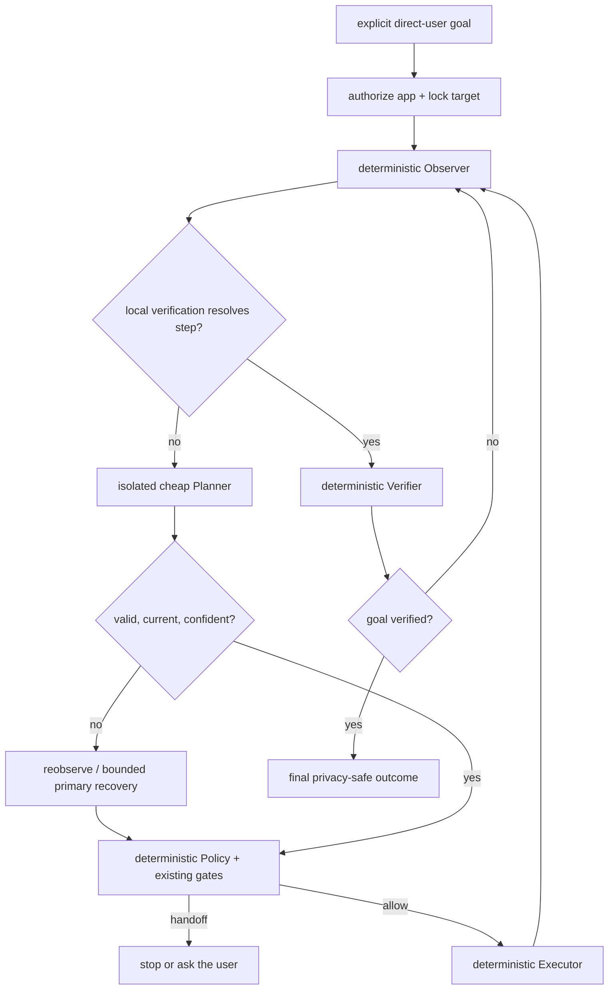

# Computer Use Lite

Computer Use Lite is the first bounded desktop-interaction architecture in
Agetha. It combines focused-window capture, local OCR controls, process/window
identity, deterministic policy and input adapters, guarded Unicode typing, and
a small one-action planner. It is not unrestricted visual autonomy.

The feature is Full-only, opt-in, and individually disabled by default:

```ini
COMPACT_MODE = yes
ENABLE_COMPUTER_USE = no
```

Only a direct `user` request may create a session. Ambient observations,
dreams, reminder text, OCR, Terminal Sentinel explanations, and `tool_result`
content cannot activate Computer Use. The master command-execution switch,
central profile decision, feature gate, Command Guard, protected-target checks,
and Unicode-typing gate remain authoritative. The fixed Notepad Full-consent
presentation is not a Computer Use session or an activation authority.

## Session pipeline



`ComputerUseManager` owns exactly one session generation. The session has a
bounded deadline, step count, recent-action list, recovery budget, local
payload vault, cancellation event, allowlisted applications, and one initial
locked target. The defaults are 30 steps and 120 seconds. A new session is not
started while another is active.

Observer, Policy, Executor, and Verifier are deterministic because they enforce
facts and safety invariants that a model must not reinterpret. They do not
become separate AI agents. The only model components are the normal cheap
planner and rare primary-model recovery.

## Scoped observation and temporary controls

`ComputerObservation` is immutable and scoped to the current target. It carries
an observation ID, process/window identity, sanitized title, window and screen
bounds, foreground/alive state, cursor position, bounded controls, previous
safe result, capture time, and honest accessibility availability.

The atomic capture bridge keeps image/OCR coordinates and window metadata from
the same capture. The observer creates temporary IDs such as `ocr:1`; an
accessibility implementation would use IDs such as `acc:1`. Controls outside
the current screen or target bounds are discarded. The planner normally chooses
a control ID rather than a coordinate. A coordinate fallback is accepted only
inside the locked target and after confidence and identity policy pass.

There is currently no real native accessibility/UI-Automation backend. The
abstraction is present, but the default provider honestly reports unavailable;
local OCR is the MVP control source. No `pywinauto`, `pywin32`, or `comtypes`
dependency was added.

Planner context contains only the goal, current scoped controls, target
basename, foreground state, recent two-to-four safe action summaries, failure
reason, step, allowed action schema, and payload-reference names. It omits full
process lists, screenshots, raw OCR history, unrelated windows, cookies,
clipboard data, credentials, memory, dreams, emotions, the character prompt,
and unrelated conversation history.

## Action schema and policy

The planner returns exactly one typed action:

```text
observe_again        move_pointer          click_control
click_point          double_click_control  scroll
type_payload          keypress              hotkey
wait                  focus_window          finish
blocked
```

Arbitrary Python, shell, PowerShell, executable invocation, scripts, and
planner-supplied text are not actions. Invalid JSON, unknown actions, stale
observation IDs, extra fields, missing fields, unsupported keys/hotkeys, and
unknown payload references fail closed.

The deterministic policy checks feature enablement, direct-user authority,
session/generation ownership, cancellation, shutdown, deadline, step limit,
observation freshness, target authorization, foreground state, bounds,
confidence, sensitive-target heuristics, and per-action rules. Enter/Return is
submit-sensitive and requires separate authorization. Focus restoration must
be explicitly requested, authorized, non-sensitive, and compatible with
presentation/fullscreen restrictions.

Sensitive contexts are handed back to the user, including strong evidence of
password/PIN/passkey/2FA/MFA/recovery-code/API-key entry, payment or banking,
password managers, security-software configuration, CAPTCHA, UAC, and the
secure desktop. Detection is conservative and is not claimed to be perfect.

## Hard target lock

Before every effectful action, the runtime revalidates:

1. expected process PID;
2. executable basename;
3. the expected non-null process creation time;
4. expected HWND and current window validity;
5. target bounds and action/control containment;
6. foreground state where the action requires it; and
7. the session application allowlist.

PID reuse, process exit, HWND replacement, bounds changes, a stale OCR control,
or the user changing focus prevents the effect. The result becomes
`TARGET_CHANGED`/reobserve or a safe stop; Agetha does not click stale
coordinates or silently fight an Alt-Tab.

Target bootstrap is deterministic rather than planner-generated. The direct
user must name a built-in application or an allowed configured executable
basename. Configured paths, command arguments, and executable names not present
in the user's text are rejected. After the ordinary Computer Use Caution guard
and feature gates, an absent named app may be launched with a fixed argument
vector and no shell. Process Awareness must then observe the exact app with a
creation timestamp and foreground window before the session locks it. Sensitive
targets, launch failure, cancellation, or failure to establish that lock stop
the bootstrap.

Only `ComputerExecutor` reaches injected mouse, keyboard, scroll, focus, wait,
or guarded-type callbacks. It performs another cancellation/shutdown/deadline
check after live validation and immediately before the effect. The Verifier
then observes again and resolves deterministic expectations locally where
possible. It does not spend a model call merely to confirm a fact already
proved by target/process state.

## Exact payload references

Exact user text stays in a session-local vault. For a request such as “Open
Notepad and type `สวัสดี`,” the planner sees a symbolic reference such as
`user_text_1`, not the value. It may return `type_payload` with that exact
reference but cannot create or rewrite the payload.

The executor resolves the reference only at the effect boundary and calls the
existing guarded Unicode typing path. That path still applies
`ENABLE_COMMAND_EXECUTION`, `ENABLE_UNICODE_TYPING`, Command Guard/preview,
target revalidation, cancellation, clipboard safeguards, and exact Unicode
preservation. It does not append Enter, Return, or Tab. Typed payload values are
not included in planner requests, status UI, normal history, observations,
audit descriptions, or logs.

Effect audits contain only bounded metadata such as a session prefix, step,
action kind, target basename, policy result, result, and timestamp. They do not
contain OCR text, window contents, screenshots, clipboard data, or payload
values, and they do not claim Undo support.

## Planner and recovery routing

The normal Computer Planner is an isolated structured request using the
configured route and model:

```ini
COMPUTER_USE_PLANNER_PROVIDER = inherit
COMPUTER_USE_PLANNER_MODEL =
COMPUTER_USE_PLANNER_CONFIDENCE_MIN = 0.65
COMPUTER_USE_RECOVERY_AFTER_FAILURES = 2
COMPUTER_USE_MAX_RECOVERY_CALLS = 2
```

`inherit` uses the configured primary route/model; a user may instead select an
existing `groq`, `openrouter`, or `ollama` route and a cheaper model. A blank
planner model inherits. Existing credentials and provider clients are reused;
there is no new secret store and no second uncoordinated provider owner.

The cheap planner is called only when local observation/verification cannot
resolve the next step. Low confidence triggers reobservation rather than a
guess. Repeated failure or persistent ambiguity may use the existing primary
provider/model through the equally isolated recovery profile. Recovery still
returns one action, cannot bypass policy, and is capped by the configured
budget. If it remains ambiguous, the session stops or asks the user. Two models
are not called for every step, and no infinite planner/recovery loop is allowed.

## STOP, Escape, status, and shutdown

The non-activating Win95 status window shows only a sanitized goal summary,
target basename, step, last action, and last result. It never shows raw OCR,
prompts, private paths, keys, or typing payloads.

STOP—or beginning a Full-to-Compact downgrade—is immediate and exact-once: it
sets the session cancellation event,
increments and invalidates the generation, discards queued or late planner results,
and prevents every later input effect without waiting for an in-flight provider
request to return. Closing the status window is also a stop. Escape uses the
same cancellation owner while Computer Use is active. On Windows, a narrowly
scoped `RegisterHotKey` listener owns Escape only for the active request and is
removed on stop, completion, preemption, or shutdown; if registration is
unavailable, the visible STOP control remains the reliable fallback. Central
shutdown sets the same stop boundary before input services and Tk are torn down.
The capability controller invalidates its Full authorization first, so a late
planner/recovery result cannot create a keyboard, mouse, or app-control effect
while teardown proceeds.

Presence Etiquette may suppress unrelated speech, movement, attention snap, or
extra popups during presentation, fullscreen/game, rapid typing, or quiet hours.
It does not cancel an otherwise safe explicitly authorized action and does not
grant one. Computer Use events reuse the Observation Bus with minimized
metadata; publication remains side-effect free. Terminal Sentinel explanation
text cannot activate this subsystem.

## Configuration

| Setting | Default | Purpose |
|---|---:|---|
| `COMPACT_MODE` | `yes` | Outer profile gate; Computer Use is denied while on |
| `ENABLE_COMPUTER_USE` | `no` | Opt-in feature gate |
| `COMPUTER_USE_MAX_STEPS` | `30` | Bounded session actions |
| `COMPUTER_USE_TIMEOUT_SEC` | `120` | Session deadline |
| `COMPUTER_USE_PLANNER_PROVIDER` | `inherit` | `inherit`, `groq`, `openrouter`, or `ollama` |
| `COMPUTER_USE_PLANNER_MODEL` | empty | Blank inherits the selected route's model |
| `COMPUTER_USE_PLANNER_CONFIDENCE_MIN` | `0.65` | Reobserve/recovery threshold |
| `COMPUTER_USE_RECOVERY_AFTER_FAILURES` | `2` | Failure count before recovery eligibility |
| `COMPUTER_USE_MAX_RECOVERY_CALLS` | `2` | Hard primary-recovery budget |
| `COMPUTER_USE_ALLOWED_APPS` | empty | Additional explicit application allowlist |

Fast Mode does not change Compact Mode, any Computer Use permission,
provider-selection, or safety setting.

## Platform support and future scope

- **Windows:** the primary Computer Use Lite target. Win32 process/window
  identity and focused capture support the full locking design, subject to OCR,
  input, target-application, privilege, and secure-desktop limitations.
  Source and frozen self-target checks recognize owned PID/HWND plus exact
  `main.py`, `main.exe`, and `Agetha.exe` identities. They do not assume the
  application is always `python.exe`.
- **Linux Xorg:** **degraded**. Process/window discovery and input depend on
  existing optional desktop tools and cannot promise the same Win32 identity
  guarantees. Any unavailable lock or input prerequisite must stop safely.
- **Linux Wayland:** **unavailable for autonomous Computer Use**. Global capture,
  focus control, and synthetic input are compositor-restricted; the application
  must not bypass that security boundary. Existing Unicode copy-only/manual
  paste behavior is not a Computer Use session.

Full Visual Computer Use is future work. A later observer may provide a scoped
screenshot to a vision-capable planner, but no mandatory vision model, PixelRAG,
browser screenshot index, or unrestricted image history exists now. The
Policy/Executor/Verifier and target-lock boundaries are intended to remain
unchanged if such an observer is added.

Use the [Computer Use manual checklist](testing/computer_use_manual.md) for
desktop validation and the [Compact/Full/frozen checklist](testing/compact_full_mode_manual.md)
for profile transitions. Do not infer a manual pass from unit tests or mocks.
