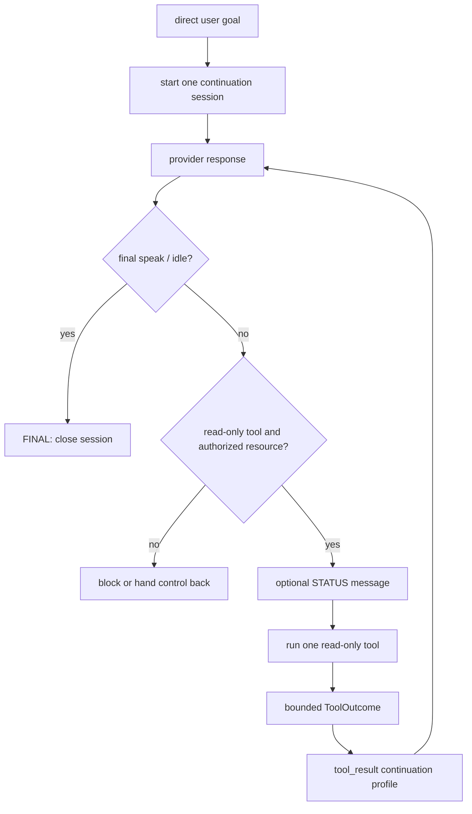

# Continuation Engine

The Continuation Engine lets one direct user goal produce several bounded
messages and read-only observations before a final answer. It is an explicit
session state machine, not a recursive call back into `_ai_tick()` and not a
general background automation framework.

Configured read-only continuation remains available in Compact Mode for safe
conversation, memory/document lookup, and WebRAG. Compact's central capability
policy still denies Process Awareness tools and every path to OS typing/control,
Computer Use, or advanced observation. Full makes individually configured tools
eligible; it does not bypass this allowlist or any feature/safety gate.

## Lifecycle and ownership

`CompanionApp` remains the application-level owner. The reusable state machine
lives in `agetha/core/continuation.py`; read-only adapters live in
`agetha/core/read_only_tools.py`.



The three conceptual message types are:

| Type | User-visible | Ends the session |
|---|---|---|
| `STATUS` | Yes; a short progress message | No |
| `TOOL_RESULT` | Normally no; only a bounded summary is retained for reasoning | No |
| `FINAL` | Yes when the final response has segments | Yes |

Only one continuation session is active at a time. A new direct user message
preempts the old generation. Session ID and generation checks discard late
provider, speech, or tool callbacks. Escape, shutdown, provider failure, tool
failure, repeated-tool cycles, malformed output, the deadline, and the step
limit all stop the session without recursion.

The default limits are six read-only steps, 120 seconds, and 8,000 characters
per provider-facing tool result. `AGENT_MAX_STEPS`,
`AGENT_MAX_DURATION_SEC`, and `AGENT_MAX_TOOL_RESULT_CHARS` are typed and
clamped by `AppSettings`. Tool history, message segments, arguments, discovered
resources, and summaries have additional internal bounds.

## Authority and trust boundary

The original request must have the `user` origin. `ambient`, `reminder`,
`terminal_sentinel`, and `tool_result` inputs cannot start a session or borrow
authority from one.

A tool result is an observation inside the existing session. It remains
untrusted data even when a model sees it on the next turn. The
`tool_continuation` request profile uses a small isolated prompt with no
personality, memories, dreams, emotions, recap, unrelated chat history, or
automatic screen context. It does not persist memory or normal conversation
history.

A response attributable to `tool_result` may select another allowlisted
read-only tool or finish. It cannot automatically dispatch state-changing
commands such as `type_text`, `computer_use`, file writes/deletes,
`run_command`, process termination, wallpaper changes, restart, or shutdown.
The dispatch boundary also treats a bare legacy `tool_result` response as
non-authoritative. Commands outside the allowlist stop the chain and require a
new direct-user decision through the normal Command Guard path.

## Read-only allowlist

The automatic allowlist is deliberately explicit:

```text
search_web          fetch_webpage       search_memory
view_memory         read_document       read_file
list_dir            list_directory      read_notepad
list_tasks          view_dreams         view_emotions
system_info         recycle_bin_status  monitor_process
get_active_app      list_running_apps
```

Every adapter returns an immutable `ToolOutcome` with a short safe summary, a
bounded provider-context block, sensitivity, continuation permission, and any
newly discovered URL resources. Existing feature and profile gates still apply.
A disabled WebRAG, memory, task, emotion, dream, or process-awareness feature
remains disabled inside a continuation; process tools are denied by Compact even
if their individual switch is on.

Resource-bearing tools are capability-scoped. File and directory paths,
process names, and initial page URLs must come from the original user request.
A successful search may authorize only the bounded result URLs it discovered;
it does not authorize arbitrary browsing. Continuation web fetches use the
built-in public-only fetch adapter. It validates and pins DNS before the
initial request and every redirect, applies one cancellation-aware absolute
deadline across DNS/TCP/TLS/headers/body, and does not follow redirects through
the legacy helper. Private, loopback, link-local, reserved, mixed-DNS, and
credential-bearing URLs fail closed.

Sensitivity is one-way. Private local results may inform a continuation, but
they do not automatically gain permission to cross into a later web request.
Secret or credential-class outcomes stop the chain. Provider context is
redacted and truncated before use; raw documents, OCR, memory text, paths,
window titles, and queries are not written to normal history or logs.

## Process-aware continuation

`agetha/platform/process_awareness.py` distinguishes the foreground
application, visible interactive applications, and background processes. A
process identity uses PID, executable basename, and creation time when
available; PID alone is not accepted as stable identity because operating
systems reuse it.

The provider-facing process context is minimized. The modes are `off`,
`foreground_only`, `visible_apps` (default), and `all_processes`. Even in
`all_processes`, a full background inventory is local unless the user
explicitly requests it. Titles, full paths, usernames, and credential-looking
data are suppressed, and a sensitive foreground application is represented
coarsely as `Sensitive application active`.

`PROCESS_STARTED`, `PROCESS_EXITED`, `FOREGROUND_APP_CHANGED`,
`VISIBLE_APP_APPEARED`, and `VISIBLE_APP_HIDDEN` reuse the Observation Bus.
They are bounded local facts only: publication does not call a provider, write
memory, open UI, or authorize a command.

## Integration rules

- Provider-operation reservation stays owned by `CompanionApp`; the state
  machine does not create overlapping provider calls.
- Read-only tool workers never call Tk. They enqueue UI callbacks into the
  app-owned queue that the Tk owner thread drains.
- Presence Etiquette may suppress nonessential voice, motion, or popups without
  granting or changing execution authority.
- Terminal Sentinel Explain remains an isolated explanation turn and cannot
  start a continuation or Computer Use session.
- The central capability decision runs before dispatch/tool effects. A Full-to-
  Compact transition invalidates advanced generations before cleanup; late tool
  or provider callbacks cannot become OS effects.
- Shutdown cancels the active generation before shared providers, screen
  services, observations, or Tk are destroyed.
- The current structure is suitable for a later explicitly started process
  watcher, but no generic long-running automation framework is implemented.

For desktop action sessions, see [Computer Use Lite](computer_use.md). For
step-by-step application sequencing, see [Runtime flows](runtime_flows.md).
