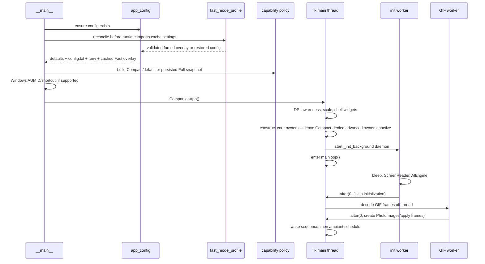
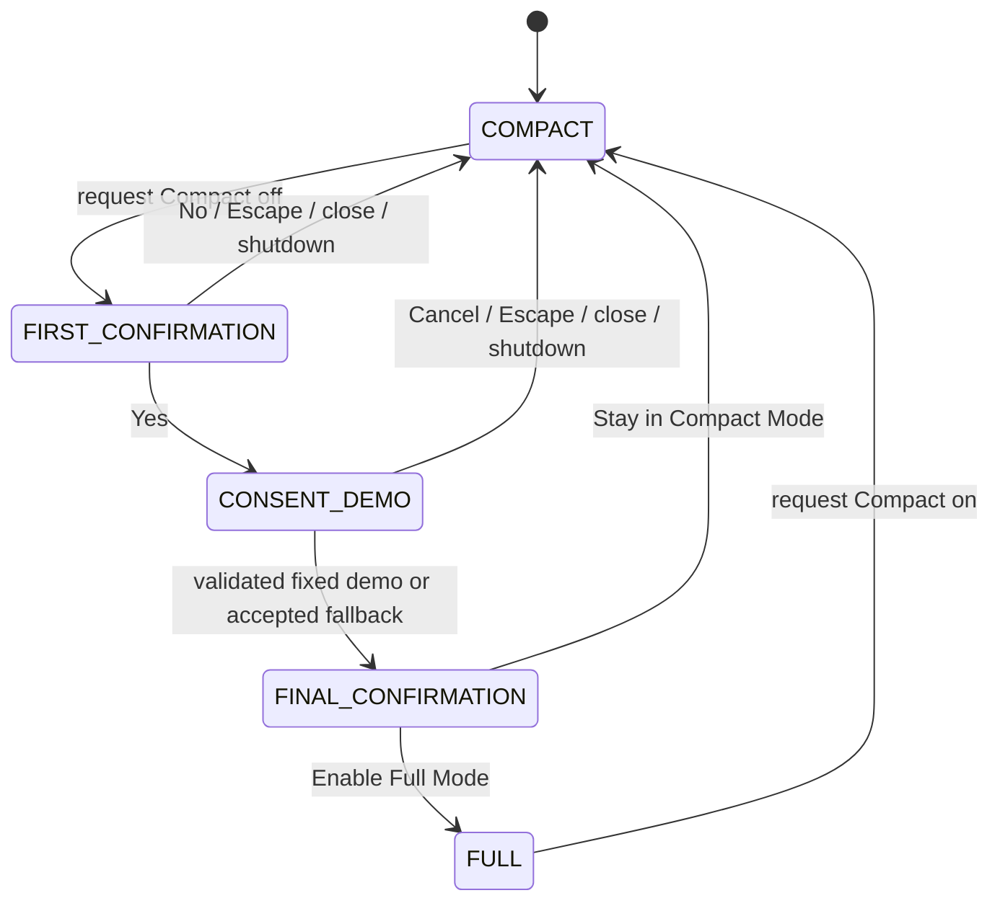
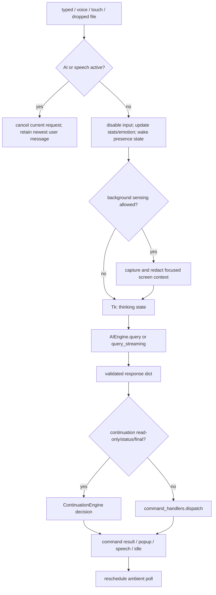
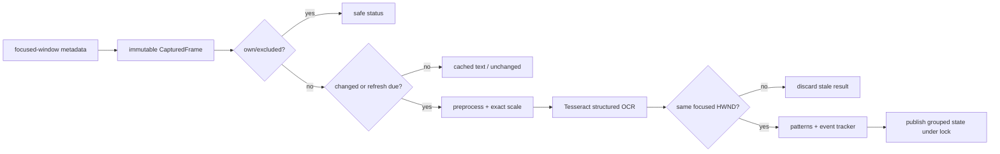
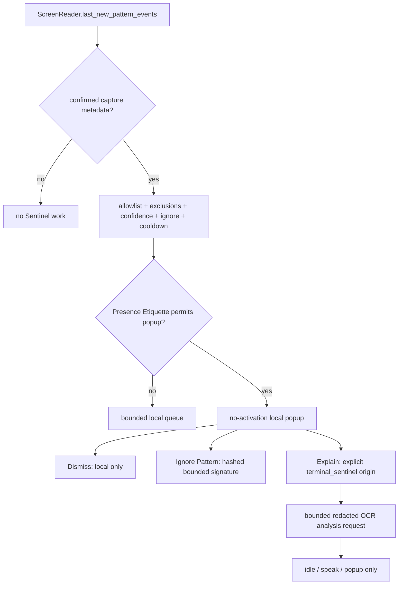
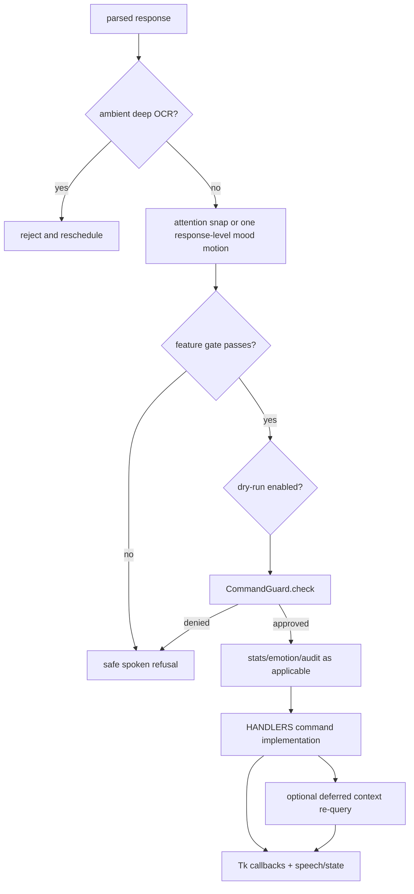

# Runtime flows

Use this document to trace control through the application without reading the
large orchestration and AI files end to end. Symbol names reflect the current
code; private names may move, but the ownership boundaries should remain.

## Execution contexts

| Context | May do | Must not do |
|---|---|---|
| Tk main thread | Create/update widgets, schedule/cancel `after()` jobs, apply geometry, create `ImageTk` objects | Sleep, run provider/OCR/network calls, decode large GIFs, wait on long operations |
| Initialization worker | Construct AI, screen, and audio services; decode non-Tk image data | Modify widgets or create `PhotoImage` objects |
| Full-consent demo worker | Launch fixed Notepad, wait/revalidate its exact process/window, type the compiled warning, and return a bounded result | Enable Full, call a provider/planner, accept an app/text argument, run a shell/Python helper, or update Tk |
| AI worker | Capture/redact screen context, call the provider, parse output, run non-Tk command work | Modify Tk widgets directly |
| Continuation tool worker | Run one generation-checked allowlisted read-only tool and return a bounded `ToolOutcome` | Start its own session, recurse into `_ai_tick()`, dispatch state-changing commands, or update Tk |
| Computer Use worker | Run one bounded observe/plan/policy/execute/verify session and publish sanitized snapshots | Update Tk, bypass target validation/Command Guard, or execute a late planner result |
| Unicode typing worker | Revalidate the approved target, use native Unicode or guarded clipboard paste, observe cancellation/shutdown | Open confirmation UI, change Tk widgets, synthesize Enter/Return/Tab |
| Senses refresh worker | Collect typed settings, installed capability hints, and already-known runtime status | Probe paid providers, reveal credentials, mutate settings, update widgets directly |
| Voice workers | Listen, recognize, and emit text callbacks | Modify Tk widgets directly |
| TTS/audio workers | Generate/play audio and observe stop/pause events | Own application shutdown or UI state |

The handoff back to Tk is normally `root.after(0, callback)`. Repeating
callbacks must retain an ID and be canceled by their owner.

## Startup



Detailed sequence:

1. A guarded bootstrap ensures `config.txt` exists and reconciles any Fast Mode
   snapshot before `AIEngine`/legacy utility imports cache settings. The normal
   `_early_config_check()` appends missing canonical non-secret `SettingSpec`
   keys through the structural atomic writer, then reloads typed settings and refreshes compatibility
   constants, and emits a one-time setup hint if no provider is usable.
   Mutating reconciliation obtains the bounded cross-process lock and
   revalidates every owned path after acquisition. Busy, unsafe, or ambiguous
   verification states fail in a controlled way and retain recovery metadata;
   see [Fast Mode security and recovery](fast_mode_security.md).
2. On Windows, notification identity and the Start Menu shortcut are established
   on a best-effort basis.
3. `CompanionApp.__init__()` establishes DPI awareness before creating Tk,
   chooses `TkinterDnD.Tk` when available, resolves high-DPI scale, and builds a
   usable shell.
4. It installs the central capability controller and consent generation. Core
   conversation/presence owners remain available; Terminal Sentinel, Process
   Awareness, Computer Use/planner/recovery, OS typing/control, and advanced
   background work are not started while Compact denies them. A persisted Full
   setting makes individually enabled owners eligible. It then constructs mood
   glow, motion, and CRT-close controllers. The title-bar close button and
   `WM_DELETE_WINDOW` connect to `_request_close()`.
5. `_init_background()` constructs optional/heavy services in a daemon thread.
   Its `_finish` callback attaches them on Tk, creates speech coordination, and
   starts GIF loading.
6. PIL decoding/resizing occurs in a worker. `ImageTk.PhotoImage` construction,
   widget attachment, placeholder cancellation, wake state, and polling begin on
   Tk.
7. A failure is reported in the in-window status/subtitle path; the process does
   not create a separate floating startup image.

## Compact/Full profile transitions

`COMPACT_MODE=yes` is the missing-key default. Compact continues chat, memory,
emotion/personality, configured WebRAG, and configured read-only continuation,
but the central policy denies advanced observation and OS effects before their
ordinary feature gates or preflight work.

Compact-to-Full is an explicit generation-bound state machine:



The first warning accurately describes advanced OS integration and retained
safety. Its optional shake is a bounded/cancellable Tk `after()` sequence;
reduced motion uses a static cue. First Yes does not enable Full.

The demo worker may launch only `notepad.exe`. It locks the launched PID,
basename, creation time, HWND, bounds, and foreground identity, then revalidates
process/window liveness, cancellation, shutdown, deadline, and consent
generation immediately before typing one compiled warning. It accepts no app or
text parameter and has no provider, Computer Planner, recovery, WebRAG, OCR,
clipboard, arbitrary command, shell, or `sys.executable` helper path. A changed
or unavailable target receives zero text and returns to an in-app fallback. The
final confirmation is still required, so the consent sequence uses zero
provider calls and a demo failure never enables Full.

Only **Enable Full Mode** atomically persists `COMPACT_MODE=no`, commits the
generation, starts individually configured Full services, and rebuilds the
Dashboard/Senses state. Any earlier rejection restores Compact and starts
nothing.

Full-to-Compact does not need a warning. The application first changes the
effective policy to transitioning Compact and invalidates Full effect/session
tokens. It then cancels Computer Use and planner/recovery, prevents new OS
effects, stops Terminal Sentinel, Process Awareness, advanced observation,
workers, and timers, discards late callbacks, hides Full UI, and atomically
persists `COMPACT_MODE=yes`. It never waits for a provider before blocking
keyboard, mouse, or application-control effects.

## Direct user turn

Sources include typed input, recognized voice text, a GIF touch, or a dropped
document. Each source eventually starts `_ai_tick(user_message)` in a worker.



Important details:

- `_ai_tick_lock`, `_ai_busy`, and `_speech_active` serialize complete response
  cycles. A newer user message sets `_cancel_event` and replaces the one-slot
  pending message rather than starting an overlapping provider call.
- Ordinary user text updates companion statistics and emotional state. Internal
  messages and the `__touch__` sentinel do not masquerade as user sentiment.
- In Full, user turns may bypass the recent-typing OCR pause for fresh screen
  context. Compact's outer sensing denial supplies no advanced capture instead;
  a prompt request does not silently start a denied observer.
- Current pattern matches are available to a direct turn; ambient turns use only
  newly confirmed events.
- Stream callbacks carry accumulated model text from the worker and schedule the
  thinking subtitle on Tk.
- Escape sets the cancellation event, re-enables input, and returns the visual
  state to idle. It also cancels the active Continuation/Computer Use
  generation. Late results check ownership before dispatch or input.
- `_run_deferred_ai_tick_callbacks()` and `_drain_pending_user_message()` run
  after `_ai_busy` is released, preventing recursive AI-query races.

## Bounded continuation turn

A direct user response may start one explicit continuation session. The
session owner never calls `_ai_tick()` recursively. Configured read-only
continuation remains eligible in Compact; any command that maps to OS control is
denied by the central capability policy as well as the continuation allowlist:

1. The initial parsed response is accepted only for the matching direct-user
   session ID and generation.
2. `speak` or `idle` is a final decision. An allowlisted read-only tool is
   normalized into an exact bounded request; anything state-changing or unknown
   stops the chain.
3. Optional response segments are shown as a `STATUS`. Speech completion returns
   to the owner and advances to the already-validated tool; it does not end the
   logical user goal.
4. A worker runs exactly one adapter and returns a bounded, redacted,
   sensitivity-labeled `ToolOutcome`. Raw tool content is normally not shown.
5. The application releases/reacquires its provider slot in the ordinary owner
   order and makes a `tool_continuation` request with the original user goal and
   the untrusted outcome. The isolated profile has no personality, memory,
   recap, unrelated history, or automatic screen context.
6. The next result may finish or select another authorized read-only tool. Step,
   duration, history, resource, sensitivity, and repeat-cycle bounds apply at
   every transition.
7. New direct input, Escape, shutdown, provider/tool failure, or expiry cancels
   the generation. Every late callback is discarded.

Page URLs, file/directory paths, and process names are scoped capabilities from
the original goal. Search results may add only bounded discovered page URLs.
`tool_result` never becomes a user origin and cannot start Computer Use or any
state-changing command. See [Continuation Engine](continuation_engine.md).

## Process-awareness flow

Process Awareness polls local platform adapters for the foreground application,
visible interactive windows, and—only for local/explicit use—the broader
process inventory. Each identity combines PID, executable basename, and
creation time when available. The snapshot is bounded, titles/paths are
sanitized, and configured or conservatively sensitive applications are
suppressed.

This owner exists/polls only when the Full profile and its individual feature
gate both allow it. Compact reports `disabled_by_compact_mode` without process
enumeration or a provider request.

Foreground and visible lifecycle transitions publish minimized Observation Bus
facts. Publication makes no provider call and grants no action authority. A
direct user turn may receive minimized process context according to
`PROCESS_CONTEXT_MODE`; a sensitive foreground is represented coarsely. A full
background list is not transmitted merely because local mode is
`all_processes`.

## Computer Use Lite flow

Computer Use begins only when the profile is Full,
`ENABLE_COMPUTER_USE=yes`, command execution is enabled, and a direct user has
explicitly requested the task. Ambient, Terminal Sentinel, `tool_result`, and
the Full-consent demonstration fail before a session starts.

1. The application extracts exact typed text into a local payload vault and
   gives the planner only reference names. It authorizes an application through
   the existing guarded path and locks the initial PID, basename, creation time,
   HWND, and bounds.
2. An atomic source captures target metadata plus local OCR controls. The
   observer assigns temporary `ocr:N` IDs; the accessibility provider currently
   reports unavailable rather than inventing native controls.
3. Local verification resolves any deterministic fact first. Otherwise the
   isolated cheap planner returns exactly one typed action for the current
   observation ID.
4. Deterministic policy checks direct-user/session authority, feature gates,
   confidence, allowed app/action/key/payload, sensitive handoff, bounds,
   deadline, step limit, cancellation, and shutdown.
5. Immediately before an effect, the executor rechecks PID, basename, creation
   time, HWND, validity, bounds, foreground state where required, and session
   authorization. A focus change, exit, PID reuse, HWND/bounds change, or stale
   control aborts the action.
6. The deterministic executor performs at most one injected effect. A
   `type_payload` resolves the local reference and calls the existing guarded
   Unicode path; no planner-created text is accepted and no Enter is appended.
7. Observer/Verifier captures again. Only unresolved or failed steps return to
   the planner. Low confidence reobserves; repeated ambiguity may use a bounded
   primary-model recovery call, which still returns one policy-bound action.
8. A sanitized status snapshot is scheduled onto Tk. STOP or Escape immediately
   sets cancellation and invalidates the generation, so an in-flight provider
   result cannot produce a later effect.

Windows is the full target for this phase. Xorg is degraded and must stop when
equivalent locking/input prerequisites are missing. Autonomous Computer Use is
unavailable on Wayland. See [Computer Use Lite](computer_use.md).

### Voice input

`VoiceInput.start()` creates one listener thread. Each captured phrase is
recognized in a daemon worker by Google Speech Recognition or the configured
local faster-whisper path. Its callback reaches
`CompanionApp._on_voice_text()`, which uses `root.after(0, ...)` before touching
the input widgets or starting the normal user flow.

### Dropped document

TkinterDnD is optional. A drop event validates and displays the selected path on
Tk, while document reading and AI work use the normal worker path. Document
content is bounded by configuration and passed as context, not executed.

## Ambient screen and presence turn

Ambient screen/provider work is Full-only. It is disabled by Compact regardless
of `ENABLE_AMBIENT_POLLS`, and also disabled when that setting is `no`, during
closing, or in deep sleep. A Compact schedule callback returns without capture,
process polling, provider use, or advanced rescheduling. Otherwise the poll
lifecycle is:

1. `_finish_wake()` schedules the first poll after the wake animation.
2. `_schedule_screen_poll()` cancels the prior stored ID and starts a daemon
   `_ai_tick(None)` worker.
3. If a direct turn or speech is active, the ambient attempt is discarded and
   rescheduled; it never queues behind a user message.
4. Recent typing can pause OCR for privacy and responsiveness. The active window
   title may still be included when enabled.
5. `ScreenReader.capture_text()` performs focused capture, an optional Windows
   PrintWindow fallback for a uniform/blank MSS frame, change detection,
   Tesseract OCR, stale-window rejection, local pattern matching, and event
   deduplication.
6. Valid capture metadata publishes minimized local active-window
   observations. Excluded/Agetha-focused/unchanged/empty states become compact
   status markers. Only confirmed `last_new_pattern_events` are attached,
   avoiding repeated reactions.
7. An enabled, allowlisted Terminal Sentinel evaluates those confirmed new
   events locally. A prepared, queued, ignored, or duplicate Sentinel event
   ends this ambient turn before a provider call. Only a later Explain click
   can begin an analysis request.
8. Presence Etiquette evaluates existing fullscreen/presentation, rapid-input,
   quiet-hour, minimized/sleeping, and shutdown state. A nonurgent ambient turn
   that would be intrusive is deferred locally before provider use.
9. `redact_for_external_context()` removes likely secrets before provider use.
   In Fast Mode, a no-event state also returns locally unless a one-shot dream
   or status observation is pending.
10. A meaningful Fast Mode ambient turn uses the `fast_ambient` profile with no
   chat history and a tiny event-oriented budget. Normal mode retains the full
   ambient behavior.
11. Dispatch may perform attention snap for configured ambient moods only when
    Presence Etiquette permits window motion; deep OCR is
   rejected before any confirmation dialog or capture.
12. After the response/speech completes, `_reschedule_screen_poll()` stores the
    next callback ID, advances stats/emotion time, and optionally starts a
    self-rate-limited status-provider worker.

`_last_screen_text` supplies continuity when a scan is intentionally skipped,
but new raw text replaces it only after a valid scan. Text sent to a cloud
provider is always passed through outbound redaction.

## Standard OCR flow

This automatic background path runs only when the central profile permits
background sensing. Compact does not reach capture/Tesseract through a merely
enabled screen-reader setting.



Capture and result geometry travel together in `CapturedFrame`; word positions
are transformed back to physical desktop coordinates, including negative
multi-monitor origins. Normal scans are serialized, while screenshot acquisition
has its own lock. This prevents two scans from accidentally combining an image
with another window's origin/title.

Automatic Tesseract OCR is local. It does not invoke Unlimited-OCR or another
network service.

## Terminal Sentinel flow

Terminal Sentinel is a consumer of the standard OCR flow, not another screen
capture loop:



The profile must be Full, the feature must be enabled, and at least one
application or title pattern must match. Compact stops both the advanced capture
path and Sentinel consumption. Existing capture exclusions, Agetha-own-window checks, frame-change
rules, event confirmation, OCR confidence, and upstream cooldown have already
run. Sentinel adds its own private-target refusal, deduplication, ignore rules,
and cooldown. Showing, dismissing, ignoring, or queueing a notification calls no
provider and performs no command. Explain obtains sanitized bounded text from
the stored notification, starts `_ai_tick(..., origin="terminal_sentinel")`,
and supplies explicit untrusted screen context. Dispatch coerces every
model-suggested command other than `idle`, `speak`, or `popup` back to a
non-action response.

## Explicit deep OCR flow

`analyze_screen_deep` is intentionally a separate command:

1. The Full advanced-integration capability, parsed name, and deep-OCR
   configuration/feature gates must all allow the request.
2. `dispatch()` rejects ambient and touch-triggered requests immediately.
3. `CommandGuard` treats the operation as Caution and asks the user before a
   screenshot can be transmitted.
4. The handler captures one immutable image and runs `capture_deep_text()` in a
   worker.
5. `UnlimitedOCRBackend` validates the configured URL and remote opt-in, writes
   a temporary PNG, sends a bounded OpenAI-compatible request, and deletes the
   temporary file in `finally`.
6. The result is wrapped as explicitly untrusted document data and used in a
   deferred follow-up AI query. The wrapper tells the model not to initiate
   another deep pass.
7. Deep OCR never overwrites `ScreenReader`'s standard OCR cache, pattern state,
   or word positions.

The configured server can be loopback or, with explicit opt-in, remote. See
[Unlimited-OCR service guide](unlimited_ocr_server.md).

## Prompt assembly

`AIEngine._build_prompt()` is shared by Groq, Gemini, OpenRouter, and Ollama modes. The
exact optional sections depend on settings, but the logical order is:

1. System persona and command/JSON contract.
2. `memory/soul.md` and recent episodic context.
3. Compact local datetime context (weekday, ISO date, time, optional seconds,
   timezone name and UTC offset).
4. Inactivity/presence signals.
5. Delimited screen/window context and safe coding-assist hint when an error
   pattern is present.
6. Dropped document, pending memory/web/notepad/deep-OCR results.
7. Long-term memory search and one-shot session recap.
8. Companion stats, emotional state/history, circadian phase, dream recall,
   tasks, and queued status observations.
9. Current user text or an explicit ambient marker.
10. Few-shot examples and bounded in-memory conversation history.

All context has configured count/character limits. OCR, retrieved pages, stored
memory, and documents are data, not instructions or authorization. Date/time
uses `core.time_context` and an injectable clock, so both direct and ambient
prompts behave deterministically in tests.

Fast Mode adds request profiles without changing that trust boundary:

| Profile | Purpose | History ceiling | Output ceiling |
|---|---|---:|---:|
| `fast_ambient` | New screen/presence event | 0 turns | 96 |
| `fast_command` | Internal or command follow-up | 2 turns | 180 |
| `fast_user` | Normal conversation | 3 turns | 220 |
| `fast_tool_result` | Document/web/memory/tool result | relevant bounded history | saved pre-Fast ceiling |
| `deep_analysis` | Explicit deep OCR | relevant bounded history | saved pre-Fast ceiling |
| `tool_continuation` | One untrusted read-only outcome in an active continuation | 0 turns | 480 |

Profile ceilings are internal bounds; the first three remain under the forced
global ceiling. Tool/deep exceptions use cached validated snapshot metadata and
never re-read credentials or the snapshot for every request. Tool/deep prompts
permit complete concise analysis rather than the quick-reply word limit. Their
final answer is retained for follow-up under a synthetic marker; raw source and
OCR payloads are not copied into conversation history.

`tool_continuation` is not a character/history profile. It keeps the original
goal and one bounded untrusted outcome, permits only final responses or the
automatic read-only allowlist, and performs no memory/history write.

## Provider and parse flow

| Mode | Adapter | Notes |
|---|---|---|
| Groq | `GroqProvider` | SDK transport, model normalization, GPT-OSS reasoning effort, and JSON Object Mode request shaping |
| Gemini | `GeminiProvider` | Gemini REST/SSE transport, system/role conversion, JSON response mode, usage conversion, and provider-specific HTTP errors |
| OpenRouter | `OpenRouterProvider` | OpenAI-compatible HTTP/SSE transport and provider-specific HTTP error conversion |
| Local | `OllamaProvider` | Local Ollama transport; completed output follows the shared streaming callback contract |

`AIEngine` retains Groq key rotation, provider fallback orchestration, bounded
repair/final publication, and Agetha request, history, and authority semantics.
Local Ollama remains exclusive when selected. Cloud fallback is explicit:
Groq, then configured Gemini, then configured OpenRouter. The existing explicit
Groq/OpenRouter startup choice remains authoritative when both are enabled.

Provider text passes through `_parse()` before dispatch. The parser:

- extracts the JSON object and applies limited repair;
- requires an allowlisted mood and command;
- normalizes speech segments and clamps pauses to `0..1.2` seconds;
- copies supported per-command arguments into a normalized result;
- applies global command, window, web, and glitch feature gates;
- converts self-window movement to the safe internal move path and refuses
  model attempts to close/kill Agetha;
- records `summary_memory` through legacy, episodic, and optional long-term
  stores.

Malformed or exhausted responses degrade to idle/error UI behavior instead of
being interpreted as an arbitrary command.

## AI response and command dispatch



The guard has Safe, Caution, and Danger tiers. Unknown commands default to
Danger. Global and feature-specific disable switches are checked before
execution; protected processes and the Agetha process remain protected. A
denied confirmation is not treated as permission, and emotional/persona state
never changes the safety tier.

`tool_result` is an internal observation origin, not a dispatch authority. The
Continuation Engine may route another allowlisted read-only adapter, but a bare
or legacy tool-result response is reduced to non-effectful output and cannot
dispatch state-changing commands or start Computer Use.

Some information-gathering commands use a two-pass pattern:

1. The first response asks for a search, page, memory, notepad, or screen read.
2. A handler performs the bounded operation.
3. It stores a labeled pending-context block.
4. `_defer_after_ai_tick()` starts one follow-up query only after the current
   transaction releases `_ai_busy`.
5. Anti-recursion state prevents the model from requesting the same lookup
   indefinitely.

## Unicode `type_text` flow

`type_text` extends the existing command rather than adding per-language
commands. The normalized schema is:

```json
{
  "command": "type_text",
  "text": "สวัสดี — こんにちは — مرحباً 👋",
  "mode": "auto",
  "speed": "normal",
  "restore_clipboard": true
}
```

The `text` field is not stripped or normalized. Unknown model-provided modes
and speeds fall back to `auto` and `normal` in the parser; direct platform API
calls reject unknown values. Dispatch first requires the Full OS-typing
capability, then applies the master and Unicode feature gates before target or
clipboard work, captures the intended external window,
builds a privacy-safe `TypingPreview`, refuses restricted/elevated targets, and
runs the ordinary Caution guard. Requests that are long, multiline, terminal,
administrator-related, shell-like, sensitive-looking, or explicitly
`preview` then require the Win95 preview decision. Sensitive detected text is
hidden and other preview content is redacted and bounded.

The handler accepts only the private approval token produced by that dispatch
path, rechecks both gates, and starts the app-owned worker. Modes behave as
follows:

| Mode | Runtime behavior |
|---|---|
| `auto` | Windows native Unicode first; safe clipboard fallback only before any native character was sent. Other supported desktops use guarded paste. |
| `unicode` | Win32 `SendInput(KEYEVENTF_UNICODE)` only; unsupported platforms fail honestly. |
| `paste` | Compare-and-restore clipboard paste into the revalidated target. |
| `preview` | Shows the destination/content preview and sends no text. |
| `paced` | Sends conservative Unicode-safe chunks with bounded delay and focus checks between chunks. |

Windows converts Python text to exact UTF-16LE code units, including surrogate
pairs. Paced boundaries avoid splitting combining marks, variation selectors,
skin-tone modifiers, zero-width joiner sequences, regional-indicator pairs, and
explicit surrogate pairs. On Xorg the adapter uses available `xclip`/`xsel` and
`xdotool` paths without introducing a mandatory package. On Wayland it copies
the exact value when possible and returns a partial outcome instructing manual
`Ctrl+V`; it does not bypass compositor restrictions. Clipboard restoration
occurs only when the clipboard still equals Agetha's last temporary value, so a
new user copy is not overwritten. Focus change, cancellation, or shutdown stops
the operation. No path appends or presses Enter, Return, or Tab.

## Senses Control Panel flow

Dashboard's Senses button calls `CompanionApp._open_senses_panel()` only when
the Full presentation exposes it and `ENABLE_SENSES_PANEL=yes`. At most one
owned panel is active. Each refresh
increments a generation, collects a local `SensesSnapshot` in an application
worker, and schedules the result onto Tk; a stale or post-close generation is
discarded. The panel reports Vision, Hearing, Memory, Network & AI, Actions, and
Presence with `available`, `unavailable`, `disabled`, `not configured`,
`degraded`, or `unknown` status. The extended phase fields cover Continuation
Engine, Process Awareness/mode, Computer Use enabled and active state, planner
route/model, primary recovery, current target/step, and last result without
showing raw OCR or payloads. It reads configuration, installed-module
hints, platform session detection, and already-known runtime state. Opening or
refreshing it does not call Groq/Gemini/OpenRouter/Ollama, test a paid endpoint, expose
an API key, change configuration, or create persistent history.

The snapshot includes the effective capability profile and reports a denied
advanced feature as `Disabled — Compact Mode`. Building that result does not
enumerate processes, capture the screen, or start the denied owner. If Senses is
hidden in the Compact presentation, the same reason remains available to the
technical state model rather than being inferred from button visibility.

## Visual state, mood, and speech

State and mood are related but separate:

- state chooses sleeping/thinking/idle/talking animation behavior;
- mood chooses the matching GIF family, bleep tone, optional glow color, speech
  presentation, and response-level movement;
- sticky command moods may survive the talking-to-idle transition.

`_set_state()` is thread-safe entry: if called from a worker, it schedules itself
on Tk. `_apply_state()` changes the active GIF and display mood. It does not
automatically bounce the window.

Response dispatch requests mood motion no more than once per completed response.
`MoodMotionController` rejects movement while disabled, in reduced motion,
cooling down, already active, dragging, minimized, closing, or while attention
snap/major geometry owns the window. Completion restores the exact starting
position.

`MoodGlowController` maintains at most one pulse callback. Disabled mode retains
the black Win95 border; reduced motion and nonanimated mode select a static mood
color. Minimize and shutdown cancel its callback.

`VoiceOutputCoordinator` chooses bleeps, TTS, or both. Subtitle drawing and
speech completion are marshaled to Tk. `_on_speech_done()` returns to idle or
requests shutdown and then reschedules ambient work.

## Minimize, tray, and restore

- Minimize cancels temporary motion/geometry, pauses GIF playback, cancels mood
  glow, and iconifies the root. Restore re-applies borderless chrome, resumes
  GIFs, and restarts eligible glow.
- Tray support is a lazy optional feature. When enabled and actually running,
  its callbacks schedule all Tk actions with `root.after()`.
- If both tray and background-close are active, a normal close request hides the
  application instead of starting final shutdown. Tray Exit takes the final
  close path.
- Without a working tray, close behavior remains ordinary and never strands an
  invisible process solely because a config flag is set.

## Close and graceful shutdown

All final close paths converge on `_request_close()` and the same shutdown
callback.

Animated path:

1. `_request_close()` sets the application closing guard, stops accepting input,
   and asks `CRTCloseController` to close.
2. The controller ignores duplicate requests, cancels competing geometry, and
   records every animation `after()` ID.
3. It widens around the current center, collapses to a horizontal line, collapses
   inward, fades, and calls `_graceful_shutdown()`.
4. Reduced motion, disabled animation, geometry/alpha failure, or scheduling
   failure calls `_graceful_shutdown()` immediately.

Cleanup path:

1. `_shutdown_complete` makes repeated calls harmless.
2. Invalidate the capability/consent generations, set close/cancel/stop signals,
   including active Continuation, Computer Use, consent demo, and Unicode typing
   cancellation, and disable new input/effects.
3. Close the Computer Use status window, Senses panel, and Sentinel popups;
   stop Process Awareness and Terminal Sentinel; shut down Presence Etiquette
   and Observation Bus; then cancel CRT, mood
   motion/glow, geometry, GIF, polling, placeholder, talking,
   wake/sleep/loaf, restore, and deferred application jobs.
4. Stop subtitle work, voice listening, TTS/bleeps, screen/deep-OCR session, and
   tray; close dashboard/child resources where owned.
5. Stop and quit the pygame mixer when initialized.
6. Cancel any remaining tracked Tk jobs, then call `root.destroy()` safely.

`run()` calls `_graceful_shutdown()` again in its `finally` block; idempotence is
therefore a required invariant, not an optimization.

## Frozen Windows entry and paths

Source launch resolves owned files from the project/package base. Under
`sys.frozen`, `app_config.BASE_DIR` is the directory containing
`sys.executable`; config, `.env`, memory/log state, and sibling assets do not
depend on the process current working directory and mutable state is not written
to `_MEIPASS`.

Frozen `sys.executable` is `main.exe`/`Agetha.exe`, not Python. Shortcut creation
uses the executable directly with no source-script argument, and the consent
demo launches fixed Notepad directly rather than starting a Python helper.
Self-target checks prefer current PID/owned HWND and then exact source/frozen
aliases, protecting both Unicode and Computer Use without broadly treating an
unrelated Python process as Agetha.

The checked-in `main.spec` currently names a console output `main` and declares
no bundled data. It is an existing packaging mechanism, but its presence is not
evidence of a completed build, asset staging, or manual executable smoke test.
Those results must be reported separately. Windows ARM64 remains x64 execution
under Prism unless a native artifact is separately produced and validated.

## Persistence flow

State-owning modules validate missing/corrupt files and serialize their own
locks. Full-file mutations use `write_atomic()` or the same temp/fsync/replace
pattern. Append-oriented JSONL files use locks and bounded rewrites when
compaction is required.

The AI response `summary_memory` has a compatibility path: it updates legacy
summary text, logs episodic memory, and optionally appends long-term searchable
memory. Never write secrets, unredacted external captures, or unbounded provider
output into persistence.

Observation Bus and Presence queues are memory-only and are cleared during
shutdown. Terminal Sentinel alone may persist bounded hashed ignore signatures
in `memory/terminal_sentinel_ignored.json`; raw OCR text is not written there.

## Failure behavior

The desktop shell should remain closable and informative when an optional
component fails:

- missing provider configuration produces a setup hint;
- missing optional TTS/tray/DnD/voice packages falls back or disables that
  feature;
- missing capture/OCR tools produces status markers rather than a UI crash;
- provider/network errors return error/idle behavior and re-enable input;
- decorative glow/motion/alpha failures are swallowed or converted to immediate
  safe cleanup;
- corrupt local state is repaired to bounded defaults where the owner supports
  it.

For edit checklists and focused test commands, continue with
[Development](development.md).
