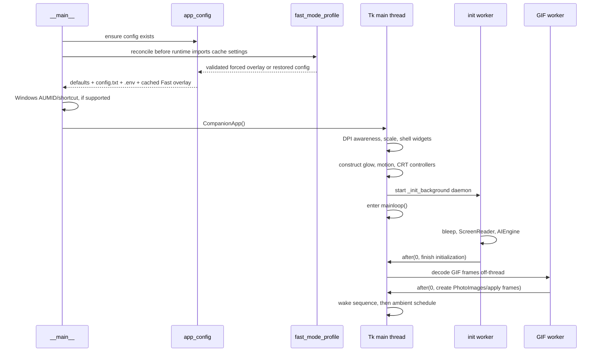
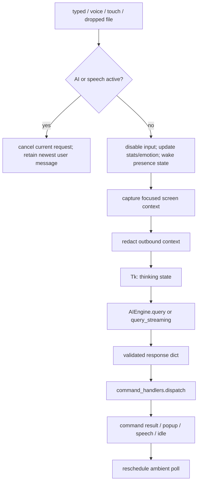
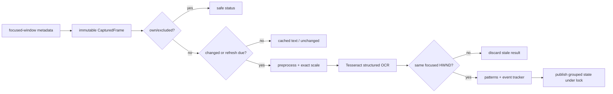
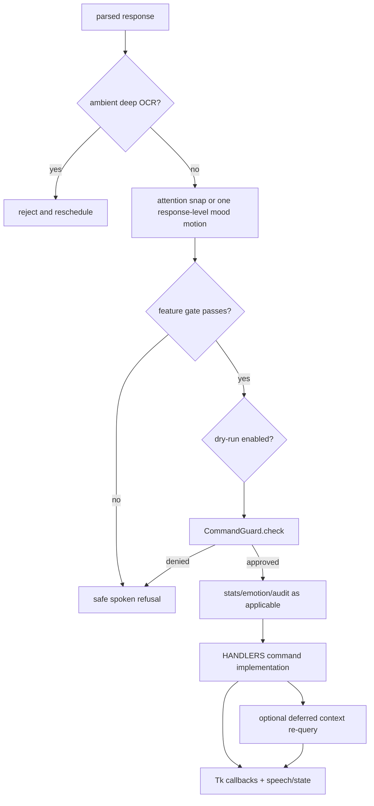

# Runtime flows

Use this document to trace control through the application without reading the
large orchestration and AI files end to end. Symbol names reflect the current
code; private names may move, but the ownership boundaries should remain.

## Execution contexts

| Context | May do | Must not do |
|---|---|---|
| Tk main thread | Create/update widgets, schedule/cancel `after()` jobs, apply geometry, create `ImageTk` objects | Sleep, run provider/OCR/network calls, decode large GIFs, wait on long operations |
| Initialization worker | Construct AI, screen, and audio services; decode non-Tk image data | Modify widgets or create `PhotoImage` objects |
| AI worker | Capture/redact screen context, call the provider, parse output, run non-Tk command work | Modify Tk widgets directly |
| Voice workers | Listen, recognize, and emit text callbacks | Modify Tk widgets directly |
| TTS/audio workers | Generate/play audio and observe stop/pause events | Own application shutdown or UI state |

The handoff back to Tk is normally `root.after(0, callback)`. Repeating
callbacks must retain an ID and be canceled by their owner.

## Startup

Detailed sequence:

1. A guarded bootstrap ensures `config.txt` exists and reconciles any Fast Mode
   snapshot before `AIEngine`/legacy utility imports cache settings. The normal
   `_early_config_check()` then reloads typed settings, refreshes compatibility
   constants, and emits a one-time setup hint if no provider is usable.
2. On Windows, notification identity and the Start Menu shortcut are established
   on a best-effort basis.
3. `CompanionApp.__init__()` establishes DPI awareness before creating Tk,
   chooses `TkinterDnD.Tk` when available, resolves high-DPI scale, and builds a
   usable shell.
4. It constructs the mood glow, motion, and CRT-close controllers and connects
   the title-bar close button and `WM_DELETE_WINDOW` to `_request_close()`.
5. `_init_background()` constructs optional/heavy services in a daemon thread.
   Its `_finish` callback attaches them on Tk, creates speech coordination, and
   starts GIF loading.
6. PIL decoding/resizing occurs in a worker. `ImageTk.PhotoImage` construction,
   widget attachment, placeholder cancellation, wake state, and polling begin on
   Tk.
7. A failure is reported in the in-window status/subtitle path; the process does
   not create a separate floating startup image.

## Direct user turn

Sources include typed input, recognized voice text, a GIF touch, or a dropped
document. Each source eventually starts `_ai_tick(user_message)` in a worker.

Important details:

- `_ai_tick_lock`, `_ai_busy`, and `_speech_active` serialize complete response
  cycles. A newer user message sets `_cancel_event` and replaces the one-slot
  pending message rather than starting an overlapping provider call.
- Ordinary user text updates companion statistics and emotional state. Internal
  messages and the `__touch__` sentinel do not masquerade as user sentiment.
- User turns bypass the recent-typing OCR pause so the question gets fresh
  screen context.
- Current pattern matches are available to a direct turn; ambient turns use only
  newly confirmed events.
- Stream callbacks carry accumulated model text from the worker and schedule the
  thinking subtitle on Tk.
- Escape sets the cancellation event, re-enables input, and returns the visual
  state to idle. Late results check the event before dispatch.
- `_run_deferred_ai_tick_callbacks()` and `_drain_pending_user_message()` run
  after `_ai_busy` is released, preventing recursive AI-query races.

### Voice input

`VoiceInput.start()` creates one listener thread. Each captured phrase is
recognized in a daemon worker by Google Speech Recognition or the configured
local faster-whisper path. Its callback reaches
`CompanionApp._on_voice_text()`, which uses `root.after(0, ...)` before touching
the input widgets or starting the normal user flow.

### Dropped document

TkinterDnD is optional. A drop event validates and displays the selected path on
Tk, while document reading and AI work use the normal worker path. Document
content is bounded by configuration and passed as context, not executed.

## Ambient screen and presence turn

Ambient work is disabled when `ENABLE_AMBIENT_POLLS=no`, during closing, or in
deep sleep. Otherwise the poll lifecycle is:

1. `_finish_wake()` schedules the first poll after the wake animation.
2. `_schedule_screen_poll()` cancels the prior stored ID and starts a daemon
   `_ai_tick(None)` worker.
3. If a direct turn or speech is active, the ambient attempt is discarded and
   rescheduled; it never queues behind a user message.
4. Recent typing can pause OCR for privacy and responsiveness. The active window
   title may still be included when enabled.
5. `ScreenReader.capture_text()` performs focused capture, change detection,
   Tesseract OCR, stale-window rejection, local pattern matching, and event
   deduplication.
6. Excluded/Agetha-focused/unchanged/empty states become compact status markers.
   Only new ambient pattern events are attached, avoiding repeated reactions.
   In Fast Mode, a no-event state returns locally without a provider request
   unless a one-shot dream or status observation is pending.
7. `redact_for_external_context()` removes likely secrets before provider use.
8. A meaningful Fast Mode ambient turn uses the `fast_ambient` profile with no
   chat history and a tiny event-oriented budget. Normal mode retains the full
   ambient behavior.
9. Dispatch may perform attention snap for configured ambient moods; deep OCR is
   rejected before any confirmation dialog or capture.
10. After the response/speech completes, `_reschedule_screen_poll()` stores the
    next callback ID, advances stats/emotion time, and optionally starts a
    self-rate-limited status-provider worker.

`_last_screen_text` supplies continuity when a scan is intentionally skipped,
but new raw text replaces it only after a valid scan. Text sent to a cloud
provider is always passed through outbound redaction.

## Standard OCR flow

Capture and result geometry travel together in `CapturedFrame`; word positions
are transformed back to physical desktop coordinates, including negative
multi-monitor origins. Normal scans are serialized, while screenshot acquisition
has its own lock. This prevents two scans from accidentally combining an image
with another window's origin/title.

Automatic Tesseract OCR is local. It does not invoke Unlimited-OCR or another
network service.

## Explicit deep OCR flow

`analyze_screen_deep` is intentionally a separate command:

1. The parsed name must be allowlisted and deep OCR must be enabled/configured.
2. `dispatch()` rejects ambient and touch-triggered requests immediately.
3. `CommandGuard` treats the operation as Caution and asks the user before a
   screenshot can be transmitted.
4. The handler captures one immutable image and runs `capture_deep_text()` in a
   worker.
5. `UnlimitedOCRBackend` validates the configured URL and remote opt-in, writes
   a temporary PNG, sends a bounded OpenAI-compatible request, and deletes the
   temporary file in `finally`.
6. The result is wrapped as explicitly untrusted document data and used in a
   deferred follow-up AI query. The wrapper tells the model not to initiate
   another deep pass.
7. Deep OCR never overwrites `ScreenReader`'s standard OCR cache, pattern state,
   or word positions.

The configured server can be loopback or, with explicit opt-in, remote. See
[Unlimited-OCR service guide](unlimited_ocr_server.md).

## Prompt assembly

`AIEngine._build_prompt()` is shared by Groq, OpenRouter, and Ollama modes. The
exact optional sections depend on settings, but the logical order is:

1. System persona and command/JSON contract.
2. `memory/soul.md` and recent episodic context.
3. Compact local datetime context (weekday, ISO date, time, optional seconds,
   timezone name and UTC offset).
4. Inactivity/presence signals.
5. Delimited screen/window context and safe coding-assist hint when an error
   pattern is present.
6. Dropped document, pending memory/web/notepad/deep-OCR results.
7. Long-term memory search and one-shot session recap.
8. Companion stats, emotional state/history, circadian phase, dream recall,
   tasks, and queued status observations.
9. Current user text or an explicit ambient marker.
10. Few-shot examples and bounded in-memory conversation history.

All context has configured count/character limits. OCR, retrieved pages, stored
memory, and documents are data, not instructions or authorization. Date/time
uses `core.time_context` and an injectable clock, so both direct and ambient
prompts behave deterministically in tests.

Fast Mode adds request profiles without changing that trust boundary:

| Profile | Purpose | History ceiling | Output ceiling |
|---|---|---:|---:|
| `fast_ambient` | New screen/presence event | 0 turns | 96 |
| `fast_command` | Internal or command follow-up | 2 turns | 180 |
| `fast_user` | Normal conversation | 3 turns | 220 |
| `fast_tool_result` | Document/web/memory/tool result | relevant bounded history | saved pre-Fast ceiling |
| `deep_analysis` | Explicit deep OCR | relevant bounded history | saved pre-Fast ceiling |

Profile ceilings are internal bounds; the first three remain under the forced
global ceiling. Tool/deep exceptions use cached validated snapshot metadata and
never re-read credentials or the snapshot for every request. Tool/deep prompts
permit complete concise analysis rather than the quick-reply word limit. Their
final answer is retained for follow-up under a synthetic marker; raw source and
OCR payloads are not copied into conversation history.

## Provider and parse flow

| Mode | Client | Notes |
|---|---|---|
| Groq | Groq SDK | Up to ten `.env` keys; model/key rotation; may fail over to configured OpenRouter |
| OpenRouter | `_OpenRouterClient` | OpenAI-compatible HTTP/SSE; capped retry/backoff for rate limits |
| Local | `_LocalOllamaClient` | Local Ollama API; completed output is chunked for the streaming callback contract |

Provider text passes through `_parse()` before dispatch. The parser:

- extracts the JSON object and applies limited repair;
- requires an allowlisted mood and command;
- normalizes speech segments and clamps pauses to `0..1.2` seconds;
- copies supported per-command arguments into a normalized result;
- applies global command, window, web, and glitch feature gates;
- converts self-window movement to the safe internal move path and refuses
  model attempts to close/kill Agetha;
- records `summary_memory` through legacy, episodic, and optional long-term
  stores.

Malformed or exhausted responses degrade to idle/error UI behavior instead of
being interpreted as an arbitrary command.

## AI response and command dispatch

The guard has Safe, Caution, and Danger tiers. Unknown commands default to
Danger. Global and feature-specific disable switches are checked before
execution; protected processes and the Agetha process remain protected. A
denied confirmation is not treated as permission, and emotional/persona state
never changes the safety tier.

Some information-gathering commands use a two-pass pattern:

1. The first response asks for a search, page, memory, notepad, or screen read.
2. A handler performs the bounded operation.
3. It stores a labeled pending-context block.
4. `_defer_after_ai_tick()` starts one follow-up query only after the current
   transaction releases `_ai_busy`.
5. Anti-recursion state prevents the model from requesting the same lookup
   indefinitely.

## Visual state, mood, and speech

State and mood are related but separate:

- state chooses sleeping/thinking/idle/talking animation behavior;
- mood chooses the matching GIF family, bleep tone, optional glow color, speech
  presentation, and response-level movement;
- sticky command moods may survive the talking-to-idle transition.

`_set_state()` is thread-safe entry: if called from a worker, it schedules itself
on Tk. `_apply_state()` changes the active GIF and display mood. It does not
automatically bounce the window.

Response dispatch requests mood motion no more than once per completed response.
`MoodMotionController` rejects movement while disabled, in reduced motion,
cooling down, already active, dragging, minimized, closing, or while attention
snap/major geometry owns the window. Completion restores the exact starting
position.

`MoodGlowController` maintains at most one pulse callback. Disabled mode retains
the black Win95 border; reduced motion and nonanimated mode select a static mood
color. Minimize and shutdown cancel its callback.

`VoiceOutputCoordinator` chooses bleeps, TTS, or both. Subtitle drawing and
speech completion are marshaled to Tk. `_on_speech_done()` returns to idle or
requests shutdown and then reschedules ambient work.

## Minimize, tray, and restore

- Minimize cancels temporary motion/geometry, pauses GIF playback, cancels mood
  glow, and iconifies the root. Restore re-applies borderless chrome, resumes
  GIFs, and restarts eligible glow.
- Tray support is a lazy optional feature. When enabled and actually running,
  its callbacks schedule all Tk actions with `root.after()`.
- If both tray and background-close are active, a normal close request hides the
  application instead of starting final shutdown. Tray Exit takes the final
  close path.
- Without a working tray, close behavior remains ordinary and never strands an
  invisible process solely because a config flag is set.

## Close and graceful shutdown

All final close paths converge on `_request_close()` and the same shutdown
callback.

Animated path:

1. `_request_close()` sets the application closing guard, stops accepting input,
   and asks `CRTCloseController` to close.
2. The controller ignores duplicate requests, cancels competing geometry, and
   records every animation `after()` ID.
3. It widens around the current center, collapses to a horizontal line, collapses
   inward, fades, and calls `_graceful_shutdown()`.
4. Reduced motion, disabled animation, geometry/alpha failure, or scheduling
   failure calls `_graceful_shutdown()` immediately.

Cleanup path:

1. `_shutdown_complete` makes repeated calls harmless.
2. Set close/cancel/stop signals and disable new input.
3. Cancel CRT, mood motion/glow, geometry, GIF, polling, placeholder, talking,
   wake/sleep/loaf, restore, and deferred application jobs.
4. Stop subtitle work, voice listening, TTS/bleeps, screen/deep-OCR session, and
   tray; close dashboard/child resources where owned.
5. Stop and quit the pygame mixer when initialized.
6. Cancel any remaining tracked Tk jobs, then call `root.destroy()` safely.

`run()` calls `_graceful_shutdown()` again in its `finally` block; idempotence is
therefore a required invariant, not an optimization.

## Persistence flow

State-owning modules validate missing/corrupt files and serialize their own
locks. Full-file mutations use `write_atomic()` or the same temp/fsync/replace
pattern. Append-oriented JSONL files use locks and bounded rewrites when
compaction is required.

The AI response `summary_memory` has a compatibility path: it updates legacy
summary text, logs episodic memory, and optionally appends long-term searchable
memory. Never write secrets, unredacted external captures, or unbounded provider
output into persistence.

## Failure behavior

The desktop shell should remain closable and informative when an optional
component fails:

- missing provider configuration produces a setup hint;
- missing optional TTS/tray/DnD/voice packages falls back or disables that
  feature;
- missing capture/OCR tools produces status markers rather than a UI crash;
- provider/network errors return error/idle behavior and re-enable input;
- decorative glow/motion/alpha failures are swallowed or converted to immediate
  safe cleanup;
- corrupt local state is repaired to bounded defaults where the owner supports
  it.

For edit checklists and focused test commands, continue with
[Development](development.md).
